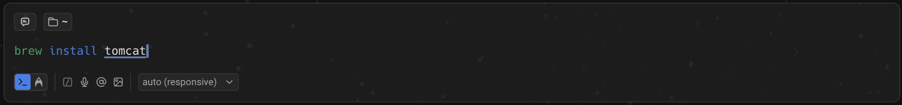
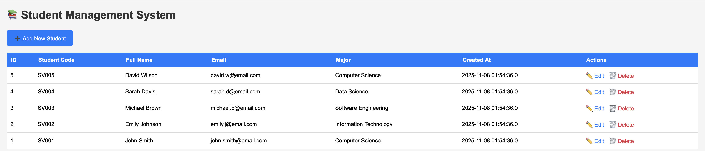
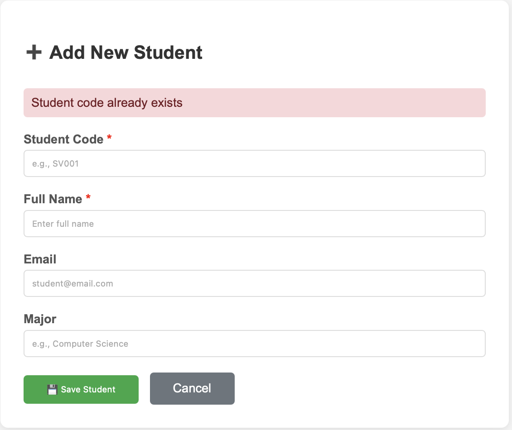
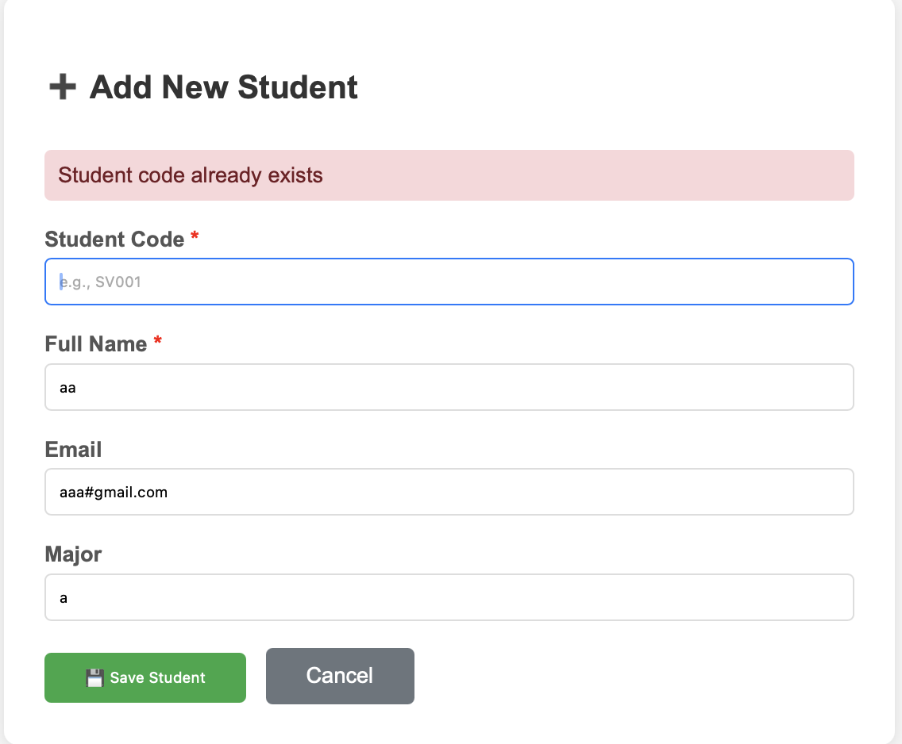
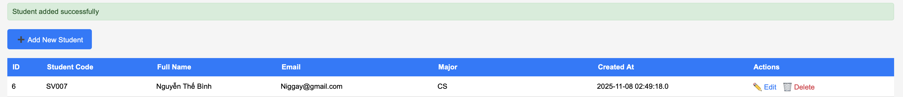
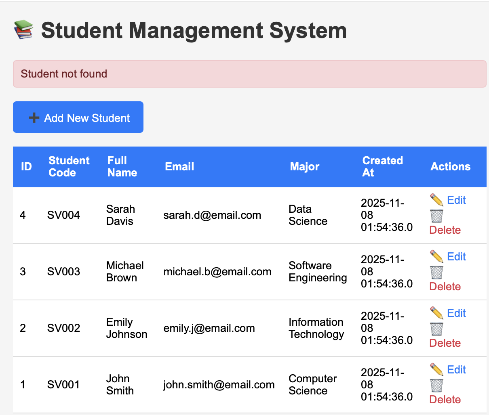
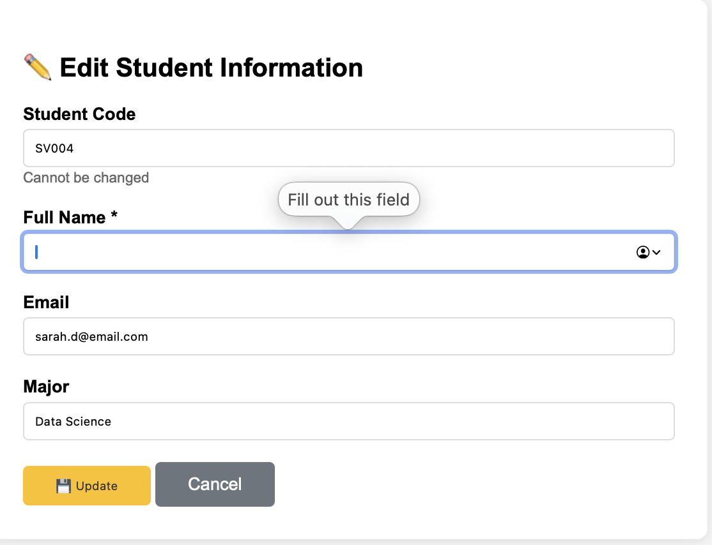
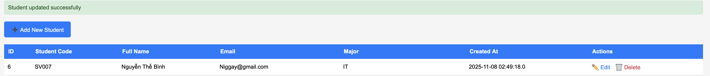
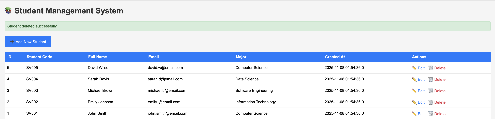

# Lab 4 - JSP + JDBC + CRUD
___
## Exercise 1
### Exercise 1.1
#### Install Tomcat
Install the Tomcat server on your local machine.
```bash
brew install tomcat
```

#### Install Java
Install Java Development Kit (JDK) on your local machine.
```bash
brew install openjdk@17
```

#### Run Tomcat Server
Start the Tomcat server using the following command:
```bash
brew services start tomcat
```
#### Verify Tomcat Installation
Open your web browser and navigate to `http://localhost:8080`. You should see the Tomcat welcome page.


### Exercise 1.2
#### How does it work?
1. User request the HTML file through the HTML
2. The Tomcat server receives the request and processes it.
3. The server locates the requested HTML file in the web application directory.
4. The server reads the HTML file and sends it back to the user's web browser as an HTTP response.
5. The user's web browser receives the HTML content and renders it for display.
6. The user can now view and interact with the HTML page in their web browser.
#### Result


### Display 
1. Header with title "Student Management System" in the `<h1>` tag.
```html
<h1>Student Management System</h1>
```
2. Messages Box to show success or error messages using `<div>` tag with conditional rendering based on URL parameters.
```html
<% String message = request.getParameter("message"); %>
<% if (message != null) { %>
    <div class="message success"><%= message %></div>
<% } %>
<% String error = request.getParameter("error"); %>
<% if (error != null) { %>
    <div class="message error"><%= error %></div>
<% } %>
```
3. Table to display the list of students with columns for ID, Name, Email, and actions (Edit/Delete) using `<table>`, `<tr>`, and `<td>` tags.
```html
<table>
    <tr>
        <th>ID</th>
        <th>Name</th>
        <th>Email</th>
        <th>Actions</th>
    </tr>
    <% while (rs.next()){ %>
    <tr>
        <td><%= rs.getInt("id") %></td>
        <td><%= rs.getString("full_name") %></td>
        <td><%= rs.getString("email") %></td>
        <td>
            <a href="edit-student.jsp?id=<%= rs.getInt("id") %>">Edit</a>
            <a href="delete-student.jsp?id=<%= rs.getInt("id") %>" onclick="return confirm('Are you sure you want to delete this student?');">Delete</a>
        </td>
    </tr>
    <% } %>
</table>
```
4. Link to add and delete a student using the `<a>` tag.
```html
<a href="add-student.jsp">Add New Student</a>
<a href="delete-student.jsp?id=<%= id %>" onclick="return confirm('Are you sure you want to delete this student?');">Delete</a>
```     
___
## Exercise 2
### Exercise 2.1
#### How the code works?
1. The JSP file `list-students.jsp` retrieves the list of students from the database MySQL using JDBC.
   1. It establishes a connection to the database using JDBC. 
   2. It executes a SQL query to fetch all student records through the code and assign the result to the `ResultSet` object.
```java
stmt = conn.createStatement();
String sql = "SELECT * FROM students ORDER BY id DESC";
rs = stmt.executeQuery(sql);
```
```java
while (rs.next()){
    int id = rs.getInt("id");
    String studentCode = rs.getString("student_code");
    String fullName = rs.getString("full_name");
    String email = rs.getString("email");
    String major = rs.getString("major");
    Timestamp createdAt = rs.getTimestamp("created_at");
    // Loop through the result set and display each student record and display it in the <tr> tag.
}
```

2. The file display the html in the tags `<table>`, `<tr>`, and `<td>`.

3. Each student record is displayed in a table row with columns for ID, Name, Email, and actions (Edit/Delete).
4. The "Edit" link redirects to the `edit-student.jsp` page with the student ID as a query parameter.
```html
<a href="edit-student.jsp?id=<%= id %>">Edit</a>
```
5. The "Delete" link redirects to the `delete-student.jsp` page with the student ID as a query parameter.
```html
<a href="delete-student.jsp?id=<%= id %>" onclick="return confirm('Are you sure you want to delete this student?');">Delete</a>
```
#### Result



### Exercise 2.2
#### How the code works?
1. The JSP file `add-student.jsp` contains an HTML form that allows users to input student details such as Student Code, Full Name, Email, and Major.
```html
<label for="student_code">Student Code:</label> 
<input type="text" id="student_code" name="student_code" required> 
<label for="full_name">Full Name:</label> 
<input type="text" id="full_name" name="full_name" required> 
<label for="email">Email:</label> 
<input type="email" id="email" name="email" required> 
<label for="major">Major:</label> 
<input type="text" id="major" name="major" required> 
<input type="submit" value="Add Student">
```
2. When the form is submitted, the data is sent to the server using the POST method.
3. The server-side code retrieves the form data using `request.getParameter()` method.
```java
    String studentCode = request.getParameter("student_code");
    String fullName = request.getParameter("full_name");
    String email = request.getParameter("email");
    String major = request.getParameter("major");
```
4. It establishes a connection to the database using JDBC.
5. It prepares an SQL `INSERT` statement to add the new student record to the database
```java
    String sql = "INSERT INTO students (student_code, full_name, email, major) VALUES (?, ?, ?, ?)";
    pstmt = conn.prepareStatement(sql);
    pstmt.setString(1, studentCode);
    pstmt.setString(2, fullName);
    pstmt.setString(3, email);
    pstmt.setString(4, major);
    int rowsAffected = pstmt.executeUpdate();
```
6. Finally, it executes the SQL statement to insert the new record into the database.
   1. If the insertion is successful, it redirects the user back to the student list page.
   2. If there is an error, it displays an error message. If have any rows affected (same id) or Database Error 
```java
   if (rowsAffected > 0) {
            response.sendRedirect("list_students.jsp?message=Student added successfully");
   }
```
```java
   catch (ClassNotFoundException e) {
        response.sendRedirect("add_student.jsp?error=Driver not found");
        e.printStackTrace();
    } catch (SQLException e) {
        String errorMsg = e.getMessage();
        if (errorMsg.contains("Duplicate entry")) {
            response.sendRedirect("add_student.jsp?error=Student code already exists");
        } else {
            response.sendRedirect("add_student.jsp?error=Database error");
        }
        e.printStackTrace();
    }
```
7. Close the database connection and other resources.
#### Result



## Exercise 3
### Exercise 3.1
#### How the code works?
1. The JSP file `edit-student.jsp` retrieves the student ID from the request parameters. If the ID is missing or invalid, it redirects the user back to the student list page with an error message.
```java
String idParam = request.getParameter("id");
int id = Integer.parseInt(idParam);
if (idParam == null || idParam.trim().isEmpty()) {
    response.sendRedirect("list_students.jsp?error=Invalid student ID");
    return;
}
try {
    studentId = Integer.parseInt(idParam);
} catch (NumberFormatException e) {
    response.sendRedirect("list_students.jsp?error=Invalid ID format");
    return;
}
```
2. It establishes a connection to the database using JDBC.
3. It prepares and executes an SQL `SELECT` statement to fetch the student record with the specified ID.
```java
String sql = "SELECT * FROM students WHERE id = ?";
pstmt = conn.prepareStatement(sql);
pstmt.setInt(1, studentId);
rs = pstmt.executeQuery();
```
4. If the student record is found, it populates the HTML form fields with the existing student data.
```java
if (rs.next()) {
    String studentCode = rs.getString("student_code");
    String fullName = rs.getString("full_name");
    String email = rs.getString("email");
    String major = rs.getString("major");
```
5. The user can modify the student details in the form and submit it.
### Exercise 3.2
#### How the code works?
6. Upon form submission, the server-side code in file `process_edit.jsp` retrieves the updated student details from the request parameters
```java
String studentCode = request.getParameter("student_code");
String fullName = request.getParameter("full_name");
String email = request.getParameter("email");
String major = request.getParameter("major");
```
7. It establishes a connection to the database using JDBC.
8. It prepares an SQL `UPDATE` statement to update the student record in the database with the new details.
```java
String sql = "UPDATE students SET student_code = ?, full_name = ?, email = ?, major = ? WHERE id = ?";
pstmt = conn.prepareStatement(sql);
pstmt.setString(1, studentCode);
pstmt.setString(2, fullName);
pstmt.setString(3, email);
pstmt.setString(4, major);
pstmt.setInt(5, id);
int rowsAffected = pstmt.executeUpdate();
```
9. Finally, it executes the SQL statement to update the record in the database.
   1. If the update is successful, it redirects the user back to the student list page with a success message.
   2. If there is an error, it displays an error message.
```java
if (rowsAffected > 0) {
    response.sendRedirect("list_students.jsp?message=Student updated successfully");
} else {
    response.sendRedirect("edit_student.jsp?id=" + id + "&error=Failed to update student");
}
```
```javacatch (ClassNotFoundException e) {
    response.sendRedirect("edit_student.jsp?id=" + id + "&error=Driver not found");
    e.printStackTrace();
} catch (SQLException e) {
    String errorMsg = e.getMessage();
    if (errorMsg.contains("Duplicate entry")) {
        response.sendRedirect("edit_student.jsp?id=" + id + "&error=Student code already exists");
    } else {
        response.sendRedirect("edit_student.jsp?id=" + id + "&error=Database error");
    }
    e.printStackTrace();
}
```
10. Close the database connection and other resources.
### Result

___
## Exercise 4
### Exercise 4.1
#### How the code works?
1. The JSP file `delete-student.jsp` retrieves the student ID from the request parameters. If the ID is missing or invalid, it redirects the user back to the student list page with an error message.
```java
String idParam = request.getParameter("id");
int id = Integer.parseInt(idParam);
if (idParam == null || idParam.trim().isEmpty()) {
    response.sendRedirect("list_students.jsp?error=Invalid student ID");
    return;
}
```
2. It establishes a connection to the database using JDBC.
3. It prepares an SQL `DELETE` statement to remove the student record with the specified ID.
```java
String sql = "DELETE FROM students WHERE id = ?";
pstmt = conn.prepareStatement(sql);
pstmt.setInt(1, studentId);
int rowsAffected = pstmt.executeUpdate();
```
4. Finally, it executes the SQL statement to delete the record from the database.
   1. If the deletion is successful, it redirects the user back to the student list page with a success message.
   2. If there is an error, it displays an error message.
```java
if (rowsAffected > 0) {
    response.sendRedirect("list_students.jsp?message=Student deleted successfully");
} else {
    response.sendRedirect("list_students.jsp?error=Failed to delete student");
}
```
```java
catch (ClassNotFoundException e) {
    response.sendRedirect("list_students.jsp?error=Driver not found");
    e.printStackTrace();
} catch (SQLException e) {
    response.sendRedirect("list_students.jsp?error=Database error");
    e.printStackTrace();
}
```
5. Close the database connection and other resources.
### Result

