# Lab 4 - JSP + JDBC + CRUD
## Exercise 5: SEARCH FUNCTIONALITY
### 5.1: Create Search Form
#### How does it work?
1. Create a search form in your JSP page (e.g., `list_students.jsp`) that allows users to input a keyword to search for students by name or code.
2. The form should submit the search query to the same page using the GET method.
3. When the form is submitted, retrieve the search keyword from the request parameters and use it to filter the student records displayed on the page.
4. If the search keyword is empty, display all student records.
5. Include a "Clear" button or link that resets the search and displays all student records again.
6. Ensure that the search input retains its value after submission for better user experience.
#### Code Snippet:
```html
<form class="search-form" action="list_students.jsp" method="GET" onsubmit="return submitForm(this)">
    <label for="keyword" class="sr-only">Search students by name or code</label>
    <input id="keyword" class="search-input" type="text" name="keyword" placeholder="Search by name or code..." value="<%= request.getParameter("keyword") != null ? request.getParameter("keyword") : "" %>">
    <button class="search-button" type="submit">Search</button>
    <a class="clear-link" href="list_students.jsp">Clear</a>
</form>
```
#### Results:
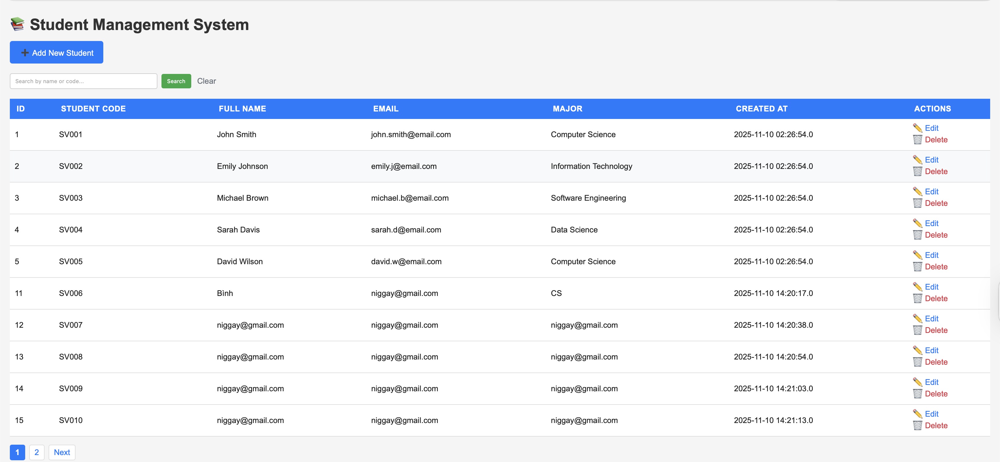

### 5.2: Implement Search Logic
#### How does it work?
1. In your JSP page (e.g., `list_students.jsp`), retrieve the search keyword from the request parameters.
2. Modify the SQL query used to fetch student records from the database to include a WHERE clause that filters records based on the search keyword.
3. Use the `LIKE` operator in SQL to perform partial matching on the student name and code fields.
4. If the search keyword is empty, fetch all student records without any filtering.
5. Display the filtered or unfiltered student records in the table on the JSP page.
#### Code Snippet:
```jsp
<%
String keyword = request.getParameter("keyword");
String sql;
if (keyword != null && !keyword.trim().isEmpty()) {
    sql = "SELECT * FROM students WHERE name LIKE ? OR code LIKE ?";    
} else {
    sql = "SELECT * FROM students";
}
PreparedStatement pstmt = conn.prepareStatement(sql);
if (keyword != null && !keyword.trim().isEmpty()) {
    String searchPattern = "%" + keyword + "%";
    pstmt.setString(1, searchPattern);
    pstmt.setString(2, searchPattern);
}
ResultSet rs = pstmt.executeQuery();
```
#### Results:
##### Test Case 1: Search with keyword "John"
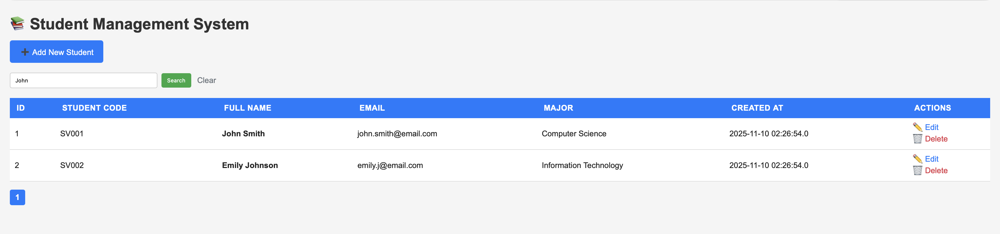
##### Test Case 2: Search with keyword "SV001"
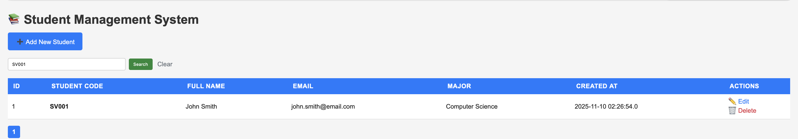
##### Test Case 3: Search with keyword "science" 
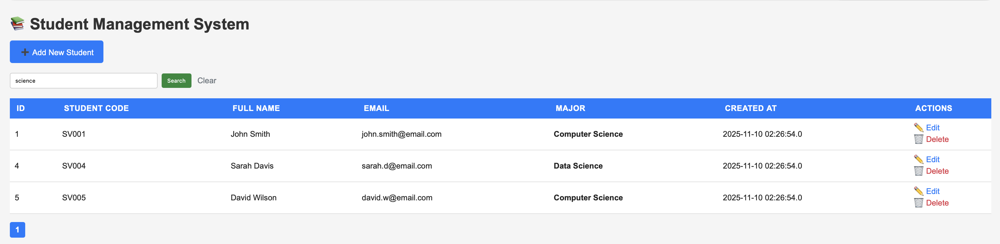
##### Test Case 3: Search with empty keyword
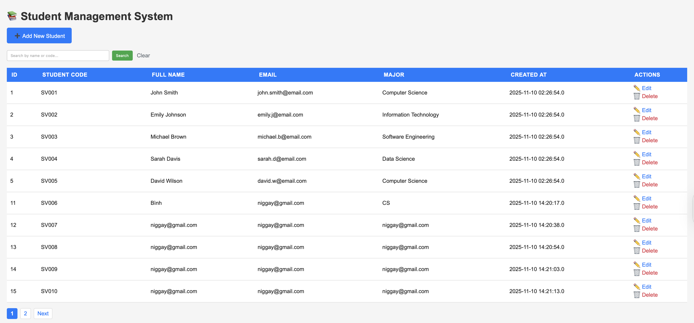
---

## Exercise 6: VALIDATION ENHANCEMENT
### 6.1: Email Validation
#### How does it work?
1. In your JSP page for adding or editing student records (e.g., `add_student.jsp` or `edit_student.jsp`), add a JavaScript function to validate the email format before form submission.
2. Use a regular expression to check if the email input matches a valid email pattern.
3. If the email format is invalid, display an error message and prevent form submission.
4. If the email format is valid, allow the form to be submitted to the server for further processing.
#### Code Snippet:
```html
<div class="form-group">
   <label for="email">Email</label>
   <input type="email" id="email" name="email" placeholder="student@email.com" 
          pattern="^[A-Za-z0-9+_.-]+@(.+)$">
</div>
```
```jsp
    String email = request.getParameter("email");
    if (email != null) email = email.trim();

    // Validate email only if provided
    String emailRegex = "^[A-Za-z0-9+_.-]+@(.+)$";
    if (email != null && !email.isEmpty()) {
        if (!email.matches(emailRegex)) {
            // Invalid email format
            response.sendRedirect("add_student.jsp?error=Invalid email format");
            return;
        }
    }
```
#### Results:
##### Test Case 1: Valid Email
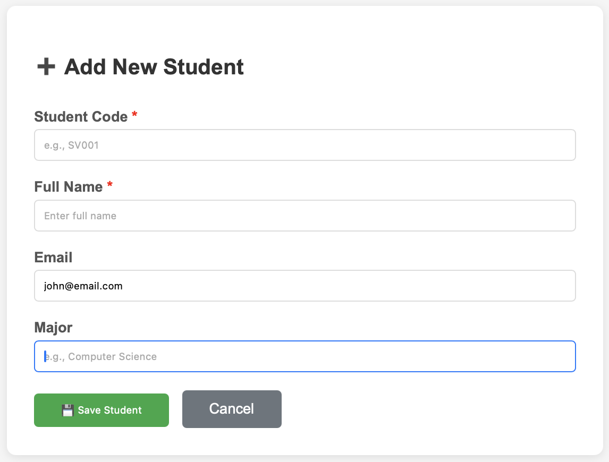
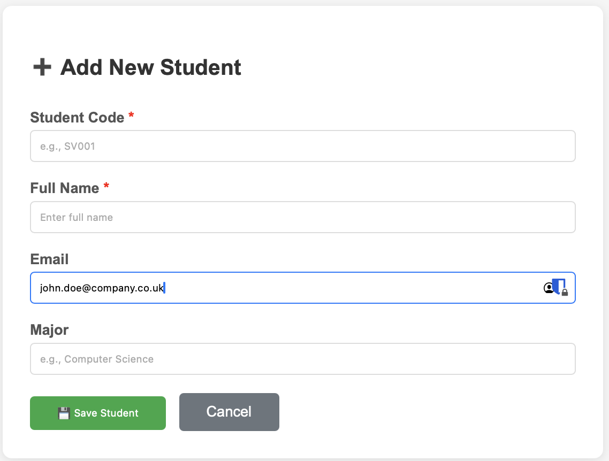
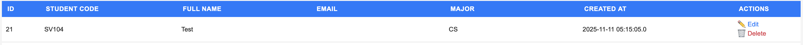
##### Test Case 2: Invalid Email
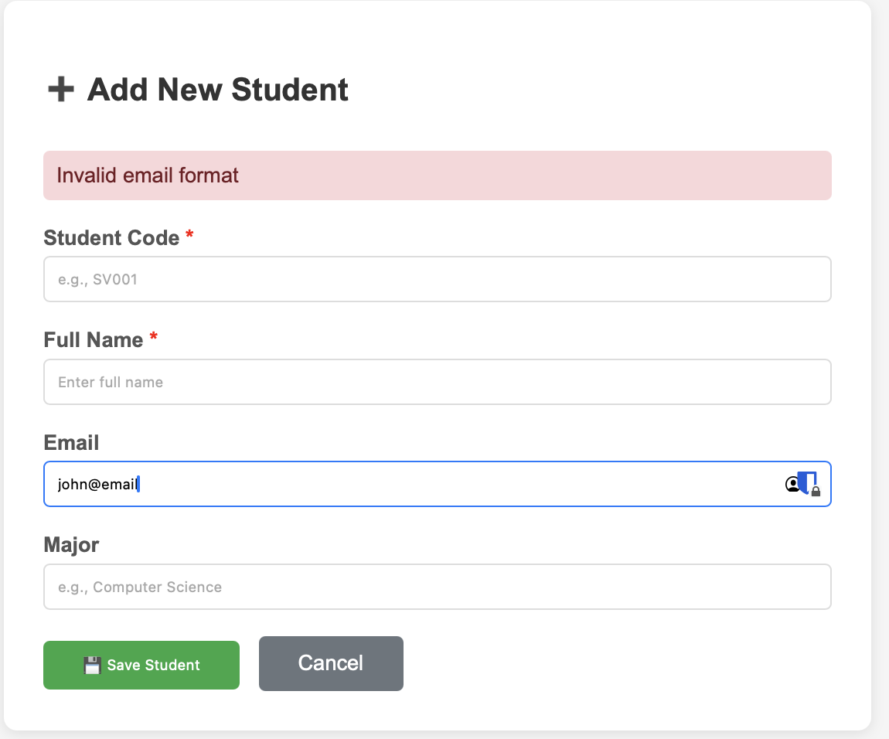
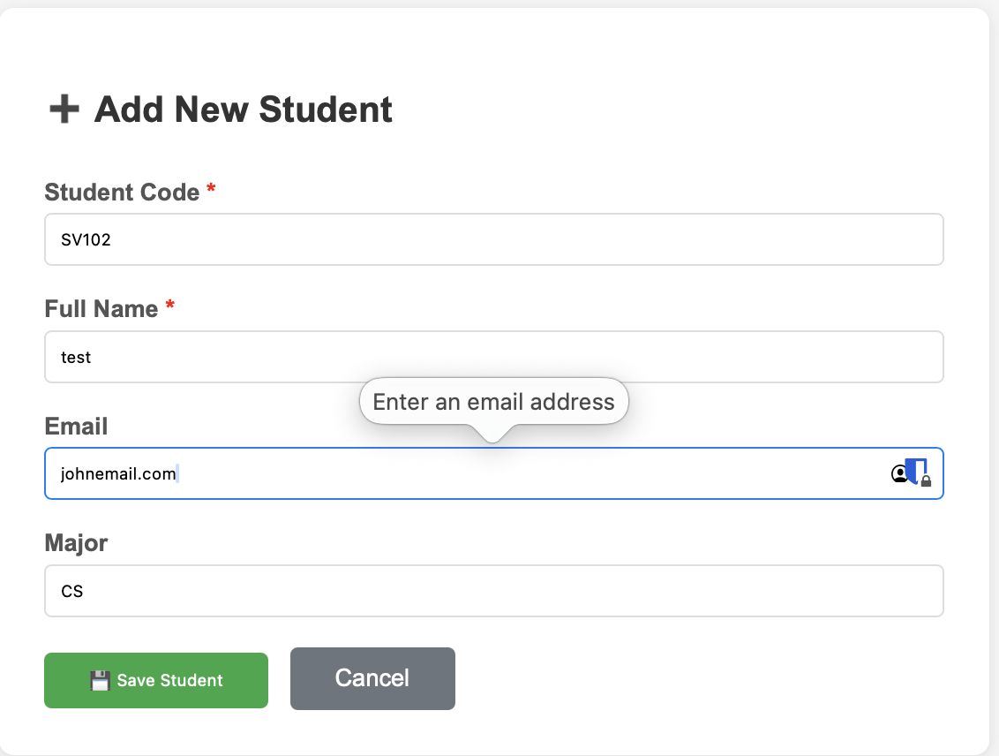

### 6.2: Student Code Validation
#### How does it work?
1. In your JSP page for adding or editing student records (e.g., `add_student.jsp` or `edit_student.jsp`), add a JavaScript function to validate the student code format before form submission.
2. Use a regular expression to check if the student code input matches the required format (e.g., starts with "SV" followed by three digits).
3. If the student code format is invalid, display an error message and prevent form submission.
4. If the student code format is valid, allow the form to be submitted to the server for further processing.
#### Code Snippet:
```html
<div class="form-group">
   <label for="code">Student Code</label>
   <input type="text" id="code" name="code" placeholder="SV001" 
          pattern="^SV\\d{3}$" required>
</div>
```
```jsp
    String studentCode =request.getParameter("code");
    studentCode = studentCode.trim();
    // Validate student code   
        if (!studentCode.matches("^[A-Z]{2}[0-9]{3,}")) {
        // Invalid student code format
        response.sendRedirect("add_student.jsp?error=Invalid student code format");
        return;
    }
```
#### Results:
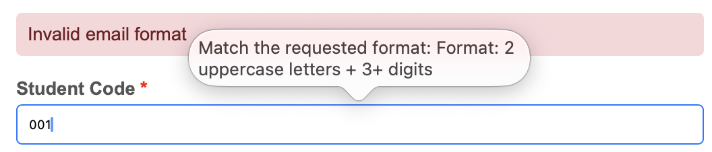
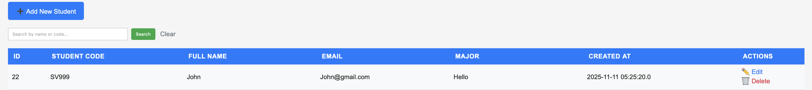

---
## Exercise 7: USER EXPERIENCE IMPROVEMENTS
### 7.1: Pagination
#### How does it work?
1. In your JSP page that lists student records (e.g., `list_students.jsp`), implement pagination to display a limited number of records per page.
2. Define a constant for the number of records to display per page (e.g., 10 records).
3. Retrieve the current page number from the request parameters. If not provided, default to page 1.
4. Calculate the starting index for the SQL query based on the current page number and the number of records per page.
5. Modify the SQL query to include a LIMIT clause to fetch only the records for the current page.
6. Calculate the total number of pages based on the total number of records in the database.
7. Display pagination controls (e.g., "Previous", "Next", and page numbers) to allow users to navigate between pages.
#### Code Snippet:
```jsp
<%
int recordsPerPage = 10;
int currentPage = 1;
if (request.getParameter("page") != null) {
    currentPage = Integer.parseInt(request.getParameter("page"));
}
int startIndex = (currentPage - 1) * recordsPerPage;    
String sql = "SELECT * FROM students LIMIT ? OFFSET ?";
PreparedStatement pstmt = conn.prepareStatement(sql);
pstmt.setInt(1, recordsPerPage);
pstmt.setInt(2, startIndex);
ResultSet rs = pstmt.executeQuery();    
// Calculate total pages
String countSql = "SELECT COUNT(*) AS total FROM students";
Statement countStmt = conn.createStatement();
ResultSet countRs = countStmt.executeQuery(countSql);
int totalRecords = 0;
if (countRs.next()) {
    totalRecords = countRs.getInt("total");
}
int totalPages = (int) Math.ceil((double) totalRecords / recordsPerPage);
%>
<div class="pagination">
    <% if (currentPage > 1) { %>
        <a href="list_students.jsp?page=<%= currentPage - 1 %>">
            Previous
        </a>
    <% } %>
    <% for (int i = 1; i <= totalPages; i++) { %
        <a href="list_students.jsp?page=<%= i %>" 
           class="<%= (i == currentPage) ? "active" : "" %>">
            <%= i %>
        </a>
    <% } %>
    <% if (currentPage < totalPages) { %>
        <a href="list_students.jsp?page=<%= currentPage + 1 %>">
            Next
        </a>
    <% } %>
</div>
```
#### Results:
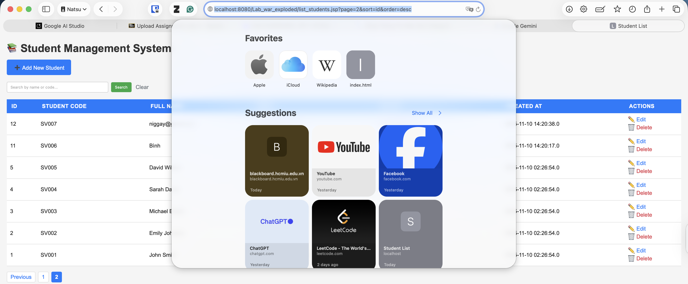

### 7.2: Improved UI/UX
a) Success/Error Message Styling (2 points)
#### How does it work?
1. In your JSP pages where CRUD operations are performed (e.g., `add_student.jsp`, `edit_student.jsp`, `delete_student.jsp`), enhance the styling of success and error messages to improve user experience.
2. Use CSS classes to differentiate between success and error messages visually.
3. Display success messages in a green box and error messages in a red box for better visibility
4. Ensure that the messages are prominently displayed at the top of the page after an operation is performed.
5. Use JavaScript to automatically hide the messages after a few seconds for a cleaner interface.
#### Code Snippet:
```CSS
        /* ===== Messages (success / error) ===== */
.message {
display: flex;
align-items: center;
gap: 8px;
padding: 10px 12px;
margin-bottom: 20px;
border-radius: 5px;
font-weight: 500;
}
.message::before {
display: inline-block;
width: 20px;
text-align: center;
font-weight: 700;
}
.message.success {
background-color: #d4edda; /* green */
color: #155724;
border: 1px solid #c3e6cb;
}
.message.success::before {
content: '✓';
color: #155724;
}

.message.error {
background-color: #f8d7da; /* red */
color: #721c24;
border: 1px solid #f5c6cb;
}
.message.error::before {
content: '✗';
color: #721c24;
}

.message.fade-out {
opacity: 0;
transition: opacity 300ms ease;
}
```
b) Loading States (2 points)
#### How does it work?
1. In your JSP pages where data is being fetched or operations are being performed (e.g., `list_students.jsp`, `add_student.jsp`), implement loading states to inform users that a process is ongoing.
2. Create a loading spinner or message that is displayed when the page is loading or when an operation is being performed.
3. Use JavaScript to show the loading spinner/message when the form is submitted and hide it once the operation is complete.
4. Ensure that the loading state is visually distinct and does not obstruct the user interface.
#### Code Snippet:
```js
    function submitForm(form) {
        try {
            var btn = form.querySelector('button[type="submit"]');
            if (btn) {
                btn.disabled = true;

                btn.dataset.origText = btn.textContent;
                btn.textContent = 'Processing...';
            }
        } catch (e) { /* ignore */ }
        return true;
    }
```
c) Responsive Table (3 points)
#### How does it work?
1. In your JSP page that lists student records (e.g., `list_students.jsp`), enhance the table to be responsive for better viewing on different screen sizes.
2. Use CSS media queries to adjust the table layout for smaller screens.
3. On smaller screens, allow horizontal scrolling for the table to ensure that all columns are accessible without breaking the layout.
4. Ensure that the table remains readable and user-friendly on both desktop and mobile devices.
#### Code Snippet:
```CSS
        /* ===== Responsive adjustments ===== */
        @media (max-width: 768px) {
            table {
                font-size: 12px;
            }
            th, td {
                padding: 5px;
            }
        }

        @media (max-width: 640px) {
            .search-input {
                width: 180px;
                max-width: 70%;
            }
            th, td {
                padding: 8px 10px;
            }
            .actions-col {
                width: 110px;
            }
        }
```

## Bonus: Sort by Column
#### How does it work?
1. In your JSP page that lists student records (e.g., `list_students.jsp`), implement sorting functionality to allow users to sort the table by different columns 
2. Make the table headers clickable links that trigger sorting when clicked.
3. Retrieve the sort column and sort order (ascending or descending) from the request parameters.
4. Modify the SQL query to include an ORDER BY clause based on the selected sort column and sort order.
5. Toggle the sort order each time a column header is clicked to allow users to switch between ascending and descending order.
#### Code Snippet:
```jsp
<%
String sortColumn = request.getParameter("sort");
String sortOrder = request.getParameter("order");
if (sortColumn == null || sortColumn.isEmpty()) {
    sortColumn = "name"; // default sort column
}
if (sortOrder == null || sortOrder.isEmpty()) {
    sortOrder = "ASC"; // default sort order
} else {
    sortOrder = sortOrder.equals("ASC") ? "DESC" : "ASC"; // toggle order
}
String sql = "SELECT * FROM students ORDER BY " + sortColumn + " " + sortOrder + " LIMIT ? OFFSET ?";
PreparedStatement pstmt = conn.prepareStatement(sql);
pstmt.setInt(1, recordsPerPage);
pstmt.setInt(2, startIndex);
ResultSet rs = pstmt.executeQuery();
%>
<th>
    <a href="list_students.jsp?sort=name&order=<%= sortOrder %>">
        Name
        <% if ("name".equals(sortColumn)) { %>
            <%= sortOrder.equals("ASC") ? "▲" : "▼" %>
        <% } %>
    </a>
</th>
<th>
    <a href="list_students.jsp?sort=code&order=<%= sortOrder %>">
        Code
        <% if ("code".equals(sortColumn)) { %>  
            <%= sortOrder.equals("ASC") ? "▲" : "▼" %>
        <% } %>
    </a>
</th>
```
#### Results:
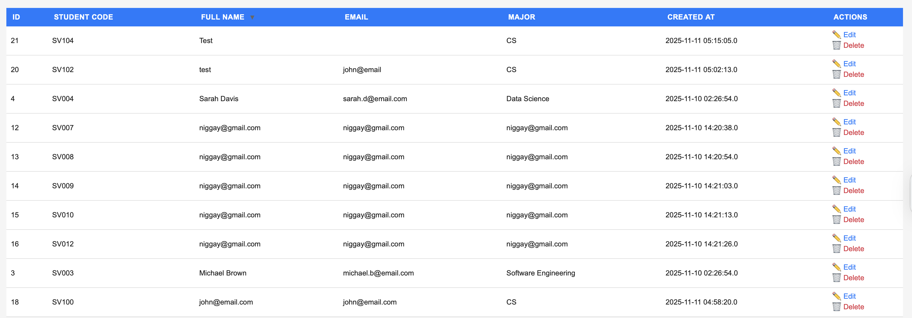