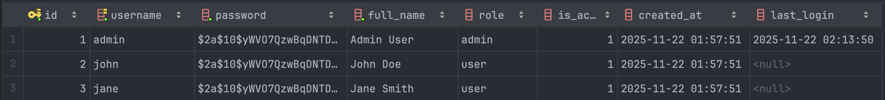
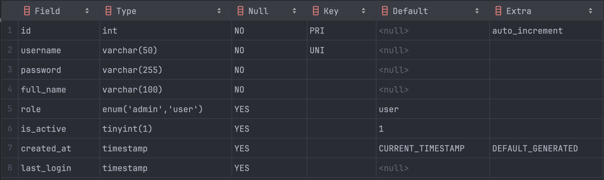
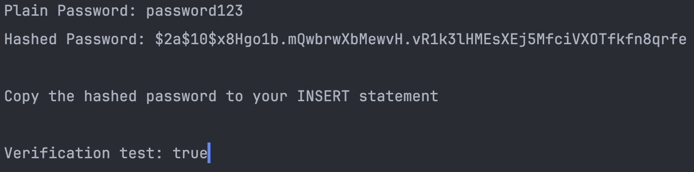
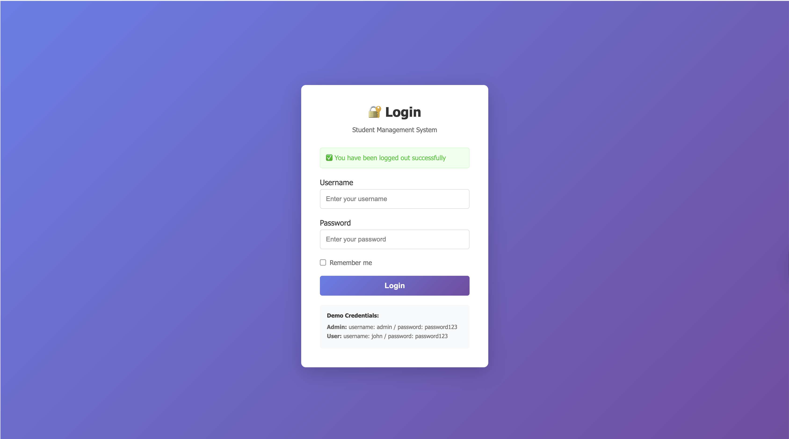
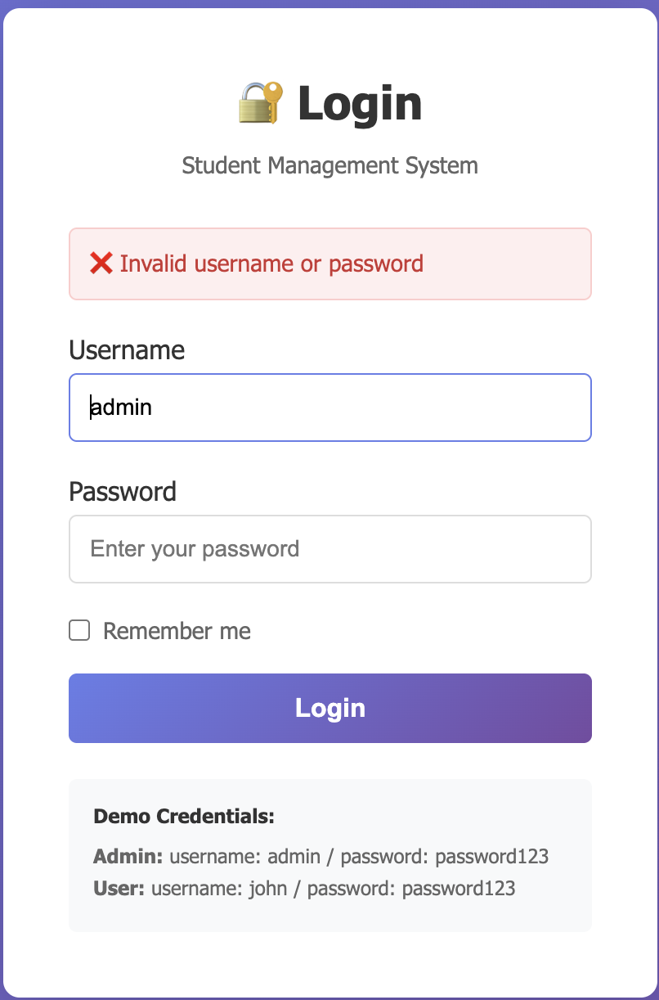
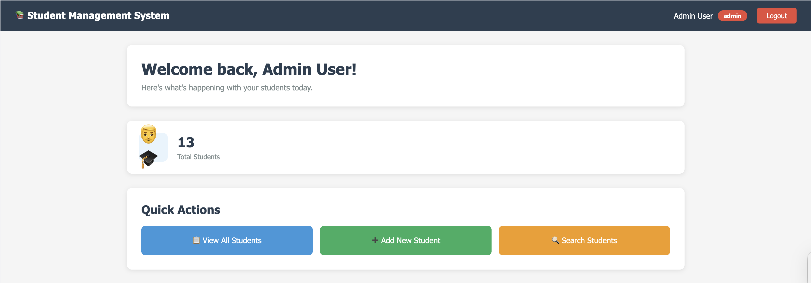

# Lab 6: AUTHENTICATION & SESSION MANAGEMENT

## EXERCISE 1: DATABASE & USER MODEL (15 points)
### Task 1.1: Create Users Table (5 points)

#### How does it work?
1. Using the provided SQL script, create a `users` table in your database with the following fields:
   - `id`: Primary key, auto-incremented integer.
   - `username`: Unique string for the user's name.
   - `password_hash`: String to store the hashed password.
   - `full_name`: String for the user's full name.
   - `role`: String to define user roles (e.g., 'admin', 'user').
   - `is_active`: Boolean to indicate if the user account is active.
   - `created_at`: Timestamp for when the user was created.
   - `updated_at`: Timestamp for the last update to the user record.
```sql
CREATE TABLE users (
                       id INT PRIMARY KEY AUTO_INCREMENT,
                       username VARCHAR(50) UNIQUE NOT NULL,
                       password VARCHAR(255) NOT NULL,
                       full_name VARCHAR(100) NOT NULL,
                       role ENUM('admin', 'user') DEFAULT 'user',
                       is_active BOOLEAN DEFAULT TRUE,
                       created_at TIMESTAMP DEFAULT CURRENT_TIMESTAMP,
                       last_login TIMESTAMP NULL
);
```

#### Results:



### Task 1.2: Generate Hashed Passwords (5 points)
#### How does it work?
1. Define the plaintext passwords for your users.
2. Using the bcrypt library, generate hashed passwords for each user.
3. Check password generation by printing the hashed passwords and verifying them against the plaintext passwords using the function `BCrypt.checkpw(plain, hash)`.
```java
    public static void main(String[] args) {
        String plainPassword = "password123";

        // Generate hash
        String hashedPassword = BCrypt.hashpw(plainPassword, BCrypt.gensalt());

        System.out.println("Plain Password: " + plainPassword);
        System.out.println("Hashed Password: " + hashedPassword);
        System.out.println("\nCopy the hashed password to your INSERT statement");

        // Test verification
        boolean matches = BCrypt.checkpw(plainPassword, hashedPassword);
        System.out.println("\nVerification test: " + matches);
    }
```

#### Results:


### Task 1.3: Insert Test Users (5 points)
#### How does it work?
1. Using the generated hashed passwords, insert at least two test users into the `users` table using SQL `INSERT` statements.
```sql
INSERT INTO users (username, password, full_name, role) VALUES
                                                            ('admin', '$2a$10$yWVO7QzwBqDNTDq6f4YwLu63bGs2/JOPV8ei2nnn3SBIPKTivtDIy', 'Admin User', 'admin'),
                                                            ('john', '$2a$10$yWVO7QzwBqDNTDq6f4YwLu63bGs2/JOPV8ei2nnn3SBIPKTivtDIy', 'John Doe', 'user'),
                                                            ('jane', '$2a$10$yWVO7QzwBqDNTDq6f4YwLu63bGs2/JOPV8ei2nnn3SBIPKTivtDIy', 'Jane Smith', 'user');
```

#### Results:


## EXERCISE 2: USER MODEL & DAO (15 points)
### Task 2.1: Create User Model (7 points)
#### How does it work?
1. Declare a `User` class with private fields corresponding to the columns in the `users` table.
2. Create 2 constructors: a default constructor and a parameterized constructor.
    - Default constructor initializes fields with empty values.
    - Parameterized constructor initializes fields with provided values.
3. Implement getter and setter methods for each field to allow access and modification.
4. Create a `toString()` method to return a string representation of the user object.
5. Create the function to check authentication `isAdmin()` and `isUser()`.

#### Results:
```java
package com.student.model;

import java.sql.Timestamp;

public class User {
    private int id;
    private String username;
    private String password;
    private String fullName;
    private String role;
    private boolean isActive;
    private Timestamp createdAt;
    private Timestamp lastLogin;

    // Constructors
    public User() {
    }

    public User(String username, String password, String fullName, String role) {
        this.username = username;
        this.password = password;
        this.fullName = fullName;
        this.role = role;
    }

    // Getters and Setters
    public int getId() {
        return id;
    }

    public void setId(int id) {
        this.id = id;
    }

    public String getUsername() {
        return username;
    }

    public void setUsername(String username) {
        this.username = username;
    }

    public String getPassword() {
        return password;
    }

    public void setPassword(String password) {
        this.password = password;
    }

    public String getFullName() {
        return fullName;
    }

    public void setFullName(String fullName) {
        this.fullName = fullName;
    }

    public String getRole() {
        return role;
    }

    public void setRole(String role) {
        this.role = role;
    }

    public boolean isActive() {
        return isActive;
    }

    public void setActive(boolean active) {
        isActive = active;
    }

    public Timestamp getCreatedAt() {
        return createdAt;
    }

    public void setCreatedAt(Timestamp createdAt) {
        this.createdAt = createdAt;
    }

    public Timestamp getLastLogin() {
        return lastLogin;
    }

    public void setLastLogin(Timestamp lastLogin) {
        this.lastLogin = lastLogin;
    }

    // Utility methods
    public boolean isAdmin() {
        return "admin".equalsIgnoreCase(this.role);
    }

    public boolean isUser() {
        return "user".equalsIgnoreCase(this.role);
    }

    @Override
    public String toString() {
        return "User{" +
                "id=" + id +
                ", username='" + username + '\'' +
                ", fullName='" + fullName + '\'' +
                ", role='" + role + '\'' +
                ", isActive=" + isActive +
                '}';
    }
}

```

### Task 2.2: Task 2.2: Create UserDAO (8 points)

#### How does it work?
1. Create a `UserDAO` class to handle database operations related to the `User` model. Define the database connection parameters `DB_URL`, `DB_USERNAME`, and `DB_PASSWORD`.
2. Implement the following methods:
   - `authenticate(String username, String password)`: using the username to retrieve the user hashed password from the database and verify it with the provided password using bcrypt. If the password matches, return the corresponding `User` object; otherwise, return `null`.
   - `getUserByID(int id)`: Retrieve a user from the database by their ID and return a `User` object.
   - `updateLastLogin(int id)`: Update the `last_login` timestamp for the user with the specified ID to the current time.
3. Close database connections and handle exceptions appropriately.

#### Results:
```java
    public static void main(String[] args) {
        UserDAO dao = new UserDAO();

        // Test authentication
        User user = dao.authenticate("admin", "password123");
        if (user != null) {
            System.out.println("Authentication successful!");
            System.out.println(user);
        } else {
            System.out.println("Authentication failed!");
        }

        // Test with wrong password
        User invalidUser = dao.authenticate("admin", "wrongpassword");
        System.out.println("Invalid auth: " + (invalidUser == null ? "Correctly rejected" : "ERROR!"));
    }
```
```bash
Authentication successful!
User{id=1, username='admin', fullName='Admin User', role='admin', isActive=true}
Invalid auth: Correctly rejected
```

## EXERCISE 3: LOGIN/LOGOUT CONTROLLERS (15 points)
### Task 3.1: Create Login Controller (10 points)
#### How does it work?
1. Create a `LoginController` servlet to handle login requests.
2. In the `doGet` method, The controller check if a user is already logged in by checking the session. If a user is found in the session, redirect them to the appropriate dashboard based on their role. If no user is found, forward the request to the login JSP page.
3. In the `doPost` method, retrieve the username and password from the request parameters. Use the `UserDAO` to authenticate the user. If authentication is successful, remove the old session storing in the DB and store the user object in the new session and redirect to the appropriate dashboard. If authentication fails, set an error message and forward back to the login JSP page.
4. Handle exceptions and ensure proper resource management.

#### Results:
```java
package com.student.controller;

import com.student.dao.UserDAO;
import com.student.model.User;

import jakarta.servlet.ServletException;
import jakarta.servlet.annotation.WebServlet;
import jakarta.servlet.http.HttpServlet;
import jakarta.servlet.http.HttpServletRequest;
import jakarta.servlet.http.HttpServletResponse;
import jakarta.servlet.http.HttpSession;
import java.io.IOException;

@WebServlet("/login")
public class LoginController extends HttpServlet {

    private UserDAO userDAO;

    @Override
    public void init() {
        userDAO = new UserDAO();
    }

    /**
     * Display login page
     */
    @Override
    protected void doGet(HttpServletRequest request, HttpServletResponse response)
            throws ServletException, IOException {

        // If already logged in, redirect to dashboard
        HttpSession session = request.getSession(false);
        if (session != null && session.getAttribute("user") != null) {
            response.sendRedirect("dashboard");
            return;
        }

        // Show login page
        request.getRequestDispatcher("/views/login.jsp").forward(request, response);
    }

    /**
     * Process login form
     */
    @Override
    protected void doPost(HttpServletRequest request, HttpServletResponse response)
            throws ServletException, IOException {

        String username = request.getParameter("username");
        String password = request.getParameter("password");
        String rememberMe = request.getParameter("remember");

        // Validate input
        if (username == null || username.trim().isEmpty() ||
                password == null || password.trim().isEmpty()) {

            request.setAttribute("error", "Username and password are required");
            request.getRequestDispatcher("/views/login.jsp").forward(request, response);
            return;
        }

        // Authenticate user
        User user = userDAO.authenticate(username, password);

        if (user != null) {
            // Authentication successful

            // Invalidate old session (prevent session fixation)
            HttpSession oldSession = request.getSession(false);
            if (oldSession != null) {
                oldSession.invalidate();
            }

            // Create new session
            HttpSession session = request.getSession(true);
            session.setAttribute("user", user);
            session.setAttribute("role", user.getRole());
            session.setAttribute("fullName", user.getFullName());

            // Set session timeout (30 minutes)
            session.setMaxInactiveInterval(30 * 60);

            // Handle "Remember Me" (optional - cookie implementation)
            if ("on".equals(rememberMe)) {
                // TODO: Implement remember me functionality with cookie
            }

            // Redirect based on role
            if (user.isAdmin()) {
                response.sendRedirect("dashboard");
            } else {
                response.sendRedirect("student?action=list");
            }

        } else {
            // Authentication failed
            request.setAttribute("error", "Invalid username or password");
            request.setAttribute("username", username); // Keep username in form
            request.getRequestDispatcher("/views/login.jsp").forward(request, response);
        }
    }
}
```

### Task 3.2: Create Logout Controller (5 points)
#### How does it work?
1. Create a `LogoutController` servlet to handle logout requests.
2. In the `doGet` method, retrieve the current session and invalidate it to log out the user. Redirect the user to the login page with a logout success message.
3. In the `doPost` method, call the `doGet` method to handle logout requests sent via POST.

#### Results:
```java
package com.student.controller;

import jakarta.servlet.ServletException;
import jakarta.servlet.annotation.WebServlet;
import jakarta.servlet.http.HttpServlet;
import jakarta.servlet.http.HttpServletRequest;
import jakarta.servlet.http.HttpServletResponse;
import jakarta.servlet.http.HttpSession;
import java.io.IOException;

@WebServlet("/logout")
public class LogoutController extends HttpServlet {

    @Override
    protected void doGet(HttpServletRequest request, HttpServletResponse response)
            throws ServletException, IOException {

        // Get current session
        HttpSession session = request.getSession(false);

        if (session != null) {
            // Invalidate session
            session.invalidate();
        }

        // Redirect to login page with message
        response.sendRedirect("login?message=You have been logged out successfully");
    }

    @Override
    protected void doPost(HttpServletRequest request, HttpServletResponse response)
            throws ServletException, IOException {
        doGet(request, response);
    }
}
```

## EXERCISE 4: VIEWS & DASHBOARD (15 points)
### Task 4.1: Create Login View (8 points)
#### How does it works?
1. Create a JSP file named `login.jsp` to serve as the login page.
2. Design a simple HTML form with fields for username and password, and a "Remember Me" checkbox.
3. Display error messages if authentication fails.
4. Style the page using CSS for better user experience.
5. Display the demo credentials for testing.

#### Results:



### Task 4.2: Create Dashboard (7 points)
#### How does it works?
1. Create a JSP file named `dashboard.jsp` to serve as the dashboard page.
2. Display a welcome message with the user's full name retrieved from the session.
3. Provide navigation links to different sections of the application based on the user's role (admin or user).
4. Include a logout link to allow users to log out of the application.
5. Style the page using CSS for better user experience.
6. Ensure that only authenticated users can access the dashboard.
7. Create a simple servlet `DashboardController` to handle requests to the dashboard page.
8. In the `doGet` method of the `DashboardController`, check if a user is logged in by verifying the session. If no user is found, redirect to the login page. If a user is found, forward the request to the `dashboard.jsp` page. Get the statics for total users and total students from the database and set them as request attributes to be displayed on the dashboard.

#### Results:

