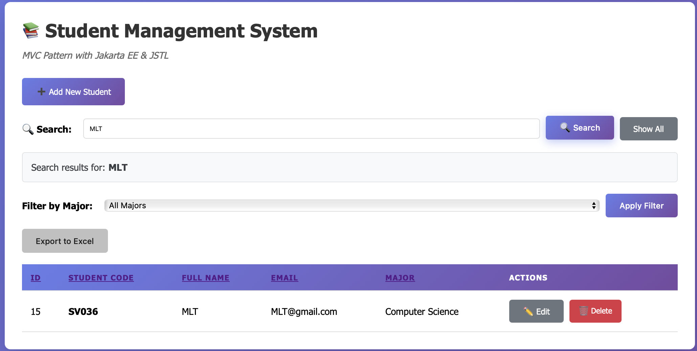

STUDENT INFORMATION:

Name: Pham Hoang Phuong

Student ID: ITCSIU23056

Class: 

COMPLETED EXERCISES:

[x] Exercise 5: Search

[x] Exercise 6: Validation

[x] Exercise 7: Sorting & Filtering

[x] Exercise 8: Pagination

[x] Bonus 1: Export Excel

[ ] BONUS 2: Photo Upload

[ ] Bonus 3: Export Excel

MVC COMPONENTS:
- Model: Student.java
- DAO: StudentDAO.java
- Controller: StudentController.java
- Views: student-list.jsp, student-form.jsp

FEATURES IMPLEMENTED:
- All CRUD operations
- Search functionality
- Server-side validation
- Sorting by columns
- Filter by major

KNOWN ISSUES:
- Filtered all major get 0 students, expected get all students

EXTRA FEATURES:


TIME SPENT: 5 hours

# EXERCISE 5: SEARCH FUNCTIONALITY (12 points)
## 5.1: Update StudentDAO (4 points)
### How does it work ?
1. Add a method public List<Student> searchStudents(String keyword). 
2. Return early (empty list) if keyword is null or blank (or adjust to return all if desired). 
3. Build SQL with three LIKE conditions and OR: `WHERE student_code LIKE ? OR full_name LIKE ? OR email LIKE ? ORDER BY id DESC`. 
4. Create wildcard pattern `String pattern = "%" + keyword.trim() + "%";`. 
5. Use try-with-resources for Connection, PreparedStatement, ResultSet. 
6. Set the same pattern into the three placeholders, execute, map rows into Student objects, add to list, and return it

### Code
```java
public List<Student> searchStudents(String keyword) {
    List<Student> students = new ArrayList<>();
    if (keyword == null || keyword.trim().isEmpty()) {
        return students; // or return getAllStudents(); if you prefer to return all when no keyword
    }

    String sql = "SELECT * FROM students "
               + "WHERE student_code LIKE ? OR full_name LIKE ? OR email LIKE ? "
               + "ORDER BY id DESC";

    String pattern = "%" + keyword.trim() + "%";

    try (Connection conn = getConnection();
         PreparedStatement ps = conn.prepareStatement(sql)) {

        ps.setString(1, pattern);
        ps.setString(2, pattern);
        ps.setString(3, pattern);

        try (ResultSet rs = ps.executeQuery()) {
            while (rs.next()) {
                Student s = new Student();
                s.setId(rs.getInt("id"));
                s.setStudentCode(rs.getString("student_code"));
                s.setFullName(rs.getString("full_name"));
                s.setEmail(rs.getString("email"));
                // map any other columns your Student model contains, e.g.:
                // s.setMajor(rs.getString("major"));
                // s.setPhone(rs.getString("phone"));
                students.add(s);
            }
        }
    } catch (SQLException e) {
        e.printStackTrace();
        // optionally rethrow or log
    }

    return students;
}
```
## 5.2: Add Search Controller Method (4 points)
### How does it work ?
1. In StudentController, add a method mapped to /students/search.
2. Accept a request parameter "keyword".
3. Call studentDAO.searchStudents(keyword) to get matching students.
4. Forward the results to student-list.jsp with the list and keyword.
### Code
```java
    private void searchStudents(HttpServletRequest request, HttpServletResponse response)
            throws ServletException, IOException {
        String keyword = request.getParameter("keyword");
        try {
            List<Student> students = studentDAO.searchStudents(keyword);
            request.setAttribute("students", students);
            request.getRequestDispatcher("/views/student-list.jsp").forward(request, response);
        } catch (Exception e) {
            request.setAttribute("error", "Failed to search students: " + e.getMessage());
            request.getRequestDispatcher("/views/student-list.jsp").forward(request, response);
        }
    }
```
## 5.3: Update Student List View (4 points)
### How does it work ?
1. Add a search form at the top of student-list.jsp.
2. The form submits to `/students?action=search` with GET method.
3. Include an input field named "keyword" and a submit button.
### Code
```jsp
    <form class="search-box" method="get" action="student?action=search">
        <input type="hidden" name="action" value="search"/>
        <label for="keyword" style="font-weight:600; margin-right:10px;">🔍 Search:</label>
        <input
                type="text"
                name="keyword"
                id="keyword"
                placeholder="Search by student code, full name, or email"
                value="${fn:escapeXml(param.keyword)}"
                style="flex:1; padding:10px; border:1px solid #ddd; border-radius:5px;"
        />
        <button type="submit" class="btn btn-primary">🔍 Search</button>

        <!-- Show All button only when search is active -->
        <c:if test="${param.action == 'search' and not empty param.keyword}">
            <a href="student?action=search" class="btn btn-secondary">Show All</a>
        </c:if>
    </form>
```
### Screenshot


# EXERCISE 6: SERVER-SIDE VALIDATION (12 points)
## 6.1: Create Validation Method (5 points)
### How does it work ?
1. In StudentController, create a method validateStudentData(HttpServletRequest request) return the booleans that indicates if the data is valid.
2. Validates the data
   - Initialize boolean isValid = true;.
   - Read and trim fields from student: code, full name, email, major. 
   - Validate Student Code:
     - If null/empty → set errorCode. Else match regex ^[A-Z]{2}\d{3,}$ → if fails set errorCode.
   - Validate Full Name:
     - If null/empty or length < 2 → set errorName. 
   - Validate Email (optional):
     - If not empty, must match regex ^[\w._%+-]+@[\w.-]+\.[A-Za-z]{2,}$ → if fails set errorEmail.
   - Validate Major:
     - If null/empty → set errorMajor.
3. Return isValid.
### Code
```java
    private boolean validateStudentData(HttpServletRequest request) {
        boolean isValid = true;

        String studentCode = request.getParameter("studentCode").trim();
        String fullName = request.getParameter("fullName").trim();
        String email = request.getParameter("email").trim();
        String major = request.getParameter("major").trim();

        // Validate Student Code
        if (studentCode == null || studentCode.isEmpty()) {
            request.setAttribute("errorCode", "Student code is required.");
            isValid = false;
        } else if (!studentCode.matches("^[A-Z]{2}\\d{3,}$")) {
            request.setAttribute("errorCode", "Student code must start with two uppercase letters followed by at least three digits.");
            isValid = false;
        }

        // Validate Full Name
        if (fullName == null || fullName.isEmpty() || fullName.length() < 2) {
            request.setAttribute("errorName", "Full name is required and must be at least 2 characters long.");
            isValid = false;
        }

        // Validate Email (optional)
        if (email != null && !email.isEmpty()) {
            if (!email.matches("^[\\w._%+-]+@[\\w.-]+\\.[A-Za-z]{2,}$")) {
                request.setAttribute("errorEmail", "Invalid email format.");
                isValid = false;
            }
        }

        // Validate Major
        if (major == null || major.isEmpty()) {
            request.setAttribute("errorMajor", "Major is required.");
            isValid = false;
        }

        return isValid;
    }
```
## 6.2: Integrate Validation into Insert/Update (3 points)
### How does it work ?
1. In insertStudent and updateStudent methods, call validateStudentData(request) before processing.
2. If validation fails, set the student object back to the request, forward to student-form
3. If validation passes, proceed with insert/update as normal.
### Code
```java
    // Insert new student
    private void insertStudent(HttpServletRequest request, HttpServletResponse response)
            throws ServletException, IOException {

        String studentCode = request.getParameter("studentCode");
        String fullName = request.getParameter("fullName");
        String email = request.getParameter("email");
        String major = request.getParameter("major");

        Student newStudent = new Student(studentCode, fullName, email, major);

        if (!validateStudent(newStudent, request)) {
            request.setAttribute("student", newStudent);
            RequestDispatcher dispatcher = request.getRequestDispatcher("/views/student-form.jsp");
            dispatcher.forward(request, response);
            return;
        }

        if (studentDAO.addStudent(newStudent)) {
            response.sendRedirect("student?action=list&message=Student added successfully");
        } else {
            response.sendRedirect("student?action=list&error=Failed to add student");
        }
    }

    // Update student
    private void updateStudent(HttpServletRequest request, HttpServletResponse response)
            throws ServletException, IOException {

        int id = Integer.parseInt(request.getParameter("id"));
        String studentCode = request.getParameter("studentCode");
        String fullName = request.getParameter("fullName");
        String email = request.getParameter("email");
        String major = request.getParameter("major");

        Student student = new Student(studentCode, fullName, email, major);
        student.setId(id);

        if (!validateStudent(student, request)) {
            request.setAttribute("student", student);
            RequestDispatcher dispatcher = request.getRequestDispatcher("/views/student-form.jsp");
            dispatcher.forward(request, response);
            return;
        }

        if (studentDAO.updateStudent(student)) {
            response.sendRedirect("student?action=list&message=Student updated successfully");
        } else {
            response.sendRedirect("student?action=list&error=Failed to update student");
        }
    }
```

## 6.3: Display Validation Errors in Form (2 points)
### How does it work ?
1. In student-form.jsp, check for error attributes (errorCode, errorName, errorEmail, errorMajor).
2. If present, display them next to the corresponding input fields.
3. Preserve user input by setting the value attributes of input fields from the student object.
4. Use JSTL to conditionally display error messages.
### Code
```jsp
    <form action="student" method="POST">
        <!-- Hidden field for action -->
        <input type="hidden" name="action"
               value="${student != null ? 'update' : 'insert'}">

        <!-- Hidden field for ID (only for update) -->
        <c:if test="${student != null}">
            <input type="hidden" name="id" value="${student.id}">
        </c:if>

        <!-- Student Code -->
        <div class="form-group">
            <label for="studentCode">
                Student Code <span class="required">*</span>
            </label>
            <input type="text"
                   id="studentCode"
                   name="studentCode"
                   value="${student.studentCode}"
            ${student != null ? 'readonly' : 'required'}
                   placeholder="e.g., SV001, IT123">
            <c:if test="${not empty errorCode}">
                <span class="error">${errorCode}</span>
            </c:if>
            <p class="info-text">Format: 2 letters + 3+ digits</p>
        </div>

        <!-- Full Name -->
        <div class="form-group">
            <label for="fullName">
                Full Name <span class="required">*</span>
            </label>
            <input type="text"
                   id="fullName"
                   name="fullName"
                   value="${student.fullName}"
                   required
                   placeholder="Enter full name">
            <c:if test="${not empty errorName}">
                <span class="error">${errorName}</span>
            </c:if>
        </div>

        <!-- Email -->
        <div class="form-group">
            <label for="email">
                Email <span class="required">*</span>
            </label>
            <input type="email"
                   id="email"
                   name="email"
                   value="${student.email}"
                   placeholder="student@example.com">
            <c:if test="${not empty errorEmail}">
                <span class="error">${errorEmail}</span>
            </c:if>
        </div>

        <!-- Major -->
        <div class="form-group">
            <label for="major">
                Major <span class="required">*</span>
            </label>
            <select id="major" name="major" required>
                <option value="">-- Select Major --</option>
                <option value="Computer Science"
                ${student.major == 'Computer Science' ? 'selected' : ''}>
                    Computer Science
                </option>
                <option value="Information Technology"
                ${student.major == 'Information Technology' ? 'selected' : ''}>
                    Information Technology
                </option>
                <option value="Software Engineering"
                ${student.major == 'Software Engineering' ? 'selected' : ''}>
                    Software Engineering
                </option>
                <option value="Business Administration"
                ${student.major == 'Business Administration' ? 'selected' : ''}>
                    Business Administration
                </option>
            </select>
            <c:if test="${not empty errorMajor}">
                <span class="error">${errorMajor}</span>
            </c:if>
        </div>
    </form>
```

### Screenshot


# EXERCISE 7: SORTING & FILTERING (10 points)
## 7.1: 7.1: Add Sort & Filter Methods to DAO (4 points)
### How does it work ?
1. In StudentDAO, add methods for sorting and filtering:
   - public List<Student> getStudentsSorted(String sortBy, String sortDir)
   - public List<Student> getStudentsByMajor(String major)
2. For sorting, build SQL with ORDER BY based on sortBy and sortDir.
3. For filtering, build SQL with WHERE major = ?.
4. Use try-with-resources for database operations, map results to Student objects, and return the lists. 
---
Challenge:
1. Implement the combined sort and filter method:
   - public List<Student> getStudentsFiltered(String major, String sortBy, String order)
2. Validate inputs sortBy and order to prevent SQL injection.
3. Build SQL dynamically based on provided parameters ` String sql = "SELECT * FROM students WHERE major = ? ORDER BY " + sortBy + " " + order;`
4. Use try-with-resources for database operations, map results to Student objects, and return the lists.
### Code
```java
    public List<Student> getStudentsFiltered(String major, String sortBy, String order) {
        List<Student> students = new ArrayList<>();

        sortBy = validateSortBy(sortBy);
        order = validateOrder(order);

        String sql = "SELECT * FROM students WHERE major = ? ORDER BY " + sortBy + " " + order;

        try (Connection conn = getConnection();
             PreparedStatement pstmt = conn.prepareStatement(sql)) {

            pstmt.setString(1, major);
            ResultSet rs = pstmt.executeQuery();

            while (rs.next()) {
                Student student = mapResultSetToStudent(rs);
                students.add(student);
            }

        } catch (SQLException e) {
            e.printStackTrace();
        }

        return students;
    }
```

## 7.2: Add Controller Methods (3 points)
### How does it work ?
1. In StudentController, add methods to handle sorting and filtering requests.
2. For sorting, read sortBy and sortDir parameters, call studentDAO.getStudentsSorted(sortBy, sortDir), and forward to student-list.jsp.
3. For filtering, read major parameter, call studentDAO.getStudentsByMajor(major), and forward to student-list.jsp.
4. Modify function protected void doGet(HttpServletRequest request, HttpServletResponse response) throws ServletException, IOException { to route requests to these new methods based on action parameters.
### Code
```java
    // Sort Student
    private void sortStudents(HttpServletRequest request, HttpServletResponse response)
            throws ServletException, IOException {
        String sortBy = request.getParameter("sortBy");
        String order = request.getParameter("order"); // "asc" or "desc"
        try {
            List<Student> students = studentDAO.getStudentsSorted(sortBy, order);
            request.setAttribute("students", students);
            request.setAttribute("sortBy", sortBy);
            request.setAttribute("order", order);
            request.getRequestDispatcher("/views/student-list.jsp").forward(request, response);
        } catch (Exception e) {
            request.setAttribute("error", "Failed to sort students: " + e.getMessage());
            request.getRequestDispatcher("/views/student-list.jsp").forward(request, response);
        }
    }
    
    private void filterStudents(HttpServletRequest request, HttpServletResponse response)
            throws ServletException, IOException {
        String major = request.getParameter("major");
        try {
            List<Student> students = studentDAO.getStudentsByMajor(major);
            request.setAttribute("students", students);
            request.setAttribute("selectedMajor", major);
            request.getRequestDispatcher("/views/student-list.jsp").forward(request, response);
        } catch (Exception e) {
            request.setAttribute("error", "Failed to filter students: " + e.getMessage());
            request.getRequestDispatcher("/views/student-list.jsp").forward(request, response);
        }
        @Override
        protected void doGet(HttpServletRequest request, HttpServletResponse response)
                throws ServletException, IOException {
    
            String action = request.getParameter("action");
    
            if (action == null) action = "list";
    
            switch (action) {
                case "new":
                    showNewForm(request, response);
                    break;
                case "edit":
                    showEditForm(request, response);
                    break;
                case "delete":
                    deleteStudent(request, response);
                    break;
                case "search":
                    searchStudents(request, response);
                    break;
                case "sort":
                    sortStudents(request, response);
                    break;
                case "filter":
                    filterStudents(request, response);
                    break;
                default:
                    listStudents(request, response);
                    break;
            }
        }
    
}
```
## 7.3: Update Student List View (3 points)
### How does it work ?
1. In student-list.jsp, add UI elements for sorting and filtering.
2. For sorting, add clickable column headers that link to /students?action=sort with sortBy and order parameters.
3. For filtering, add a dropdown to select major that submits to /students?action=filter with the selected major.
4. Use JSTL to maintain the current sort and filter states in the UI.
### Code
```jsp
    <!-- Filter by Major -->
    <div class="filter-box">
        <form action="student" method="get">
            <input type="hidden" name="action" value="filter">
            <label for="major">Filter by Major:</label>
            <select id="major" name="major">
                <option value="">All Majors</option>
                <option value="Computer Science" ${selectedMajor == 'Computer Science' ? 'selected' : ''}>
                    Computer Science
                </option>
                <option value="Information Technology" ${selectedMajor == 'Information Technology' ? 'selected' : ''}>
                    Information Technology
                </option>
                <option value="Software Engineering" ${selectedMajor == 'Software Engineering' ? 'selected' : ''}>
                    Software Engineering
                </option>
                <option value="Business Administration" ${selectedMajor == 'Business Administration' ? 'selected' : ''}>
                    Business Administration
                </option>
            </select>

            <button type="submit">Apply Filter</button>
            <c:if test="${not empty selectedMajor}">
                <a href="student?action=list">Clear Filter</a>
            </c:if>
        </form>
    </div>
    <!-- Student Table -->
                <thead>
                <tr>
                    <th>
                        <a href="student?action=sort&sortBy=id&order=${sortBy == 'id' && order == 'asc' ? 'desc' : 'asc'}">
                            ID
                            <c:if test="${sortBy == 'id'}">${order == 'asc' ? '▲' : '▼'}</c:if>
                        </a>
                    </th>
                    <th>
                        <a href="student?action=sort&sortBy=student_code&order=${sortBy == 'student_code' && order == 'asc' ? 'desc' : 'asc'}">
                            Student Code
                            <c:if test="${sortBy == 'student_code'}">${order == 'asc' ? '▲' : '▼'}</c:if>
                        </a>
                    </th>
                    <th>
                        <a href="student?action=sort&sortBy=full_name&order=${sortBy == 'full_name' && order == 'asc' ? 'desc' : 'asc'}">
                            Full Name
                            <c:if test="${sortBy == 'full_name'}">${order == 'asc' ? '▲' : '▼'}</c:if>
                        </a>
                    </th>
                    <th>
                        <a href="student?action=sort&sortBy=email&order=${sortBy == 'email' && order == 'asc' ? 'desc' : 'asc'}">
                            Email
                            <c:if test="${sortBy == 'email'}">${order == 'asc' ? '▲' : '▼'}</c:if>
                        </a>
                    </th>
                    <th>
                        <a href="student?action=sort&sortBy=major&order=${sortBy == 'major' && order == 'asc' ? 'desc' : 'asc'}">
                            Major
                            <c:if test="${sortBy == 'major'}">${order == 'asc' ? '▲' : '▼'}</c:if>
                        </a>
                    </th>
                    <th>Actions</th>
                </tr>
                </thead>
```
### Screenshot


# EXERCISE 8: PAGINATION (10 points)
## 8.1: Add Pagination Methods to DAO (3 points)
### How does it work ?
1. In StudentDAO, add method `public int getTotalStudents()` to get total student count.
2. Add method `public List<Student> getStudentsPaginated(int offset, int limit)` to get students for a specific page.
3. Use SQL COUNT(*) for total count and LIMIT/OFFSET for pagination.
4. Use try-with-resources for database operations, map results to Student objects, and return the lists.
### Code
```java
    // Get Total Students Count
    public int getTotalStudents() {
        String sql = "SELECT COUNT(*) AS total FROM students";
        try (Connection conn = getConnection();
             Statement stmt = conn.createStatement();
             ResultSet rs = stmt.executeQuery(sql)) {

            if (rs.next()) {
                return rs.getInt("total");
            }

        } catch (SQLException e) {
            e.printStackTrace();
        }
        return 0;
    }
    
    // Pagination
    public List<Student> getStudentsPaginated(int offset, int limit) {
        List<Student> students = new ArrayList<>();
        String sql = "SELECT * FROM students ORDER BY id DESC LIMIT ? OFFSET ?";

        try (Connection conn = getConnection();
             PreparedStatement pstmt = conn.prepareStatement(sql)) {

            pstmt.setInt(1, limit);
            pstmt.setInt(2, offset);
            ResultSet rs = pstmt.executeQuery();

            while (rs.next()) {
                Student student = mapResultSetToStudent(rs);
                students.add(student);
            }

        } catch (SQLException e) {
            e.printStackTrace();
        }
        return students;
    }
```

## 8.2: Add Pagination Controller Logic (3 points)
### How does it work ?
1. In StudentController, modify listStudents method to handle pagination.
2. Read page parameter, calculate offset based on page number and page size.
3. Call studentDAO.getStudentsPaginated(offset, pageSize) to get students for the current page.
4. Call studentDAO.getTotalStudents() to get total count and calculate total pages.
5. Set attributes for students, currentPage, totalPages, and forward to student-list.jsp
### Code
```java
    private void listStudents(HttpServletRequest request, HttpServletResponse response)
            throws ServletException, IOException {
        try {
            // Get current page (default to 1)
            String pageParam = request.getParameter("page");
            int currentPage = 1;

            if (pageParam != null) {
                try {
                    currentPage = Integer.parseInt(pageParam);
                } catch (NumberFormatException e) {
                    currentPage = 1;
                }
            }

            // Records per page
            int recordsPerPage = 10;

            // Get total records and calculate total pages
            int totalRecords = studentDAO.getTotalStudents();
            int totalPages = (int) Math.ceil((double) totalRecords / recordsPerPage);

            // Handle edge cases
            if (currentPage < 1) {
                currentPage = 1;
            }
            if (totalPages > 0 && currentPage > totalPages) {
                currentPage = totalPages;
            }

            // Calculate offset
            int offset = (currentPage - 1) * recordsPerPage;

            // Get paginated data
            List<Student> students = studentDAO.getStudentsPaginated(offset, recordsPerPage);

            // Set attributes
            request.setAttribute("students", students);
            request.setAttribute("currentPage", currentPage);
            request.setAttribute("totalPages", totalPages);
            request.setAttribute("totalRecords", totalRecords);

            System.out.println("Page " + currentPage + "/" + totalPages + " - Loaded " + students.size() + " students.");

            request.getRequestDispatcher("/views/student-list.jsp").forward(request, response);

        } catch (Exception e) {
            request.setAttribute("error", "Failed to load students: " + e.getMessage());
            request.getRequestDispatcher("/views/student-list.jsp").forward(request, response);
        }
    }
```

## 8.3: Update Student List View for Pagination (4 points)
### How does it work ?
1. In student-list.jsp, add pagination controls at the bottom of the student table.
2. Display current page, total pages, and total records.
3. Add Previous and Next buttons, disabling them appropriately.
4. Use JSTL to generate page links dynamically.
### Code
```jsp
<!-- Advanced Pagination with limited page numbers -->
            <c:if test="${totalPages > 1}">
                <div class="pagination">
                    <!-- First button -->
                    <c:if test="${currentPage > 3}">
                        <a href="student?action=list&page=1">« First</a>
                    </c:if>

                    <!-- Previous button -->
                    <c:choose>
                        <c:when test="${currentPage > 1}">
                            <a href="student?action=list&page=${currentPage - 1}">‹ Prev</a>
                        </c:when>
                        <c:otherwise>
                            <span class="disabled">‹ Prev</span>
                        </c:otherwise>
                    </c:choose>

                    <!-- Page numbers (show 5 pages around current) -->
                    <c:set var="startPage" value="${currentPage - 2 > 1 ? currentPage - 2 : 1}" />
                    <c:set var="endPage" value="${currentPage + 2 < totalPages ? currentPage + 2 : totalPages}" />

                    <c:if test="${startPage > 1}">
                        <span>...</span>
                    </c:if>

                    <c:forEach begin="${startPage}" end="${endPage}" var="i">
                        <c:choose>
                            <c:when test="${i == currentPage}">
                                <strong>${i}</strong>
                            </c:when>
                            <c:otherwise>
                                <a href="student?action=list&page=${i}">${i}</a>
                            </c:otherwise>
                        </c:choose>
                    </c:forEach>

                    <c:if test="${endPage < totalPages}">
                        <span>...</span>
                    </c:if>

                    <!-- Next button -->
                    <c:choose>
                        <c:when test="${currentPage < totalPages}">
                            <a href="student?action=list&page=${currentPage + 1}">Next ›</a>
                        </c:when>
                        <c:otherwise>
                            <span class="disabled">Next ›</span>
                        </c:otherwise>
                    </c:choose>

                    <!-- Last button -->
                    <c:if test="${currentPage < totalPages - 2}">
                        <a href="student?action=list&page=${totalPages}">Last »</a>
                    </c:if>
                </div>

                <!-- Enhanced pagination info with record range -->
                <c:set var="startRecord" value="${(currentPage - 1) * 10 + 1}" />
                <c:set var="endRecord" value="${currentPage * 10 > totalRecords ? totalRecords : currentPage * 10}" />

                <p style="text-align: center; color: #666; margin-top: 10px; font-size: 14px;">
                    Showing <strong>${startRecord}-${endRecord}</strong> of <strong>${totalRecords}</strong> records
                    (Page ${currentPage} of ${totalPages})
                </p>
            </c:if>
```
### Screenshot


# BONUS 1: EXPORT EXCEL (5 points)
## How does it work ?
1. In StudentController, add method exportToExcel to handle /students/export request.
2. Use Apache POI to create an Excel workbook, add headers and student data.
3. Set response headers for file download
4. Write the students data into the Excel file and send it in the response.
### Code
```java
@WebServlet("/export")
public class ExportController extends HttpServlet {

    private final StudentDAO studentDAO = new StudentDAO();

    @Override
    protected void doGet(HttpServletRequest request, HttpServletResponse response) throws ServletException, IOException {

        List<Student> students = studentDAO.getAllStudents();

        // Create workbook and sheet
        try (XSSFWorkbook workbook = new XSSFWorkbook()) {
            Sheet sheet = workbook.createSheet("Students");

            // Header row
            Row header = sheet.createRow(0);
            String[] headers = new String[] { "ID", "Student Code", "Full Name", "Major", "Email"};
            for (int i = 0; i < headers.length; i++) {
                Cell cell = header.createCell(i);
                cell.setCellValue(headers[i]);
            }

            // Data rows
            int rowIdx = 1;
            for (Student s : students) {
                Row row = sheet.createRow(rowIdx++);
                int col = 0;
                row.createCell(col++).setCellValue(s.getId());
                row.createCell(col++).setCellValue(nullToEmpty(s.getStudentCode()));
                row.createCell(col++).setCellValue(nullToEmpty(s.getFullName()));
                row.createCell(col++).setCellValue(nullToEmpty(s.getMajor()));
                row.createCell(col++).setCellValue(nullToEmpty(s.getEmail()));
            }

            // Autosize columns
            for (int i = 0; i < headers.length; i++) {
                sheet.autoSizeColumn(i);
            }

            // Set response headers
            response.setContentType("application/vnd.openxmlformats-officedocument.spreadsheetml.sheet");
            response.setHeader("Content-Disposition", "attachment; filename=students.xlsx");

            // Write workbook to response
            workbook.write(response.getOutputStream());
            response.getOutputStream().flush();
        } catch (Exception e) {
            throw new ServletException("Error exporting students to Excel", e);
        }
    }

    private String nullToEmpty(String s) {
        return s == null ? "" : s;
    }
}
```
```jsp
    <div class="export-box">
        <form id="exportForm" action="${pageContext.request.contextPath}/export" method="get" style="display:inline;">
            <input type="hidden" name="keyword" value="${param.keyword}" />
            <input type="hidden" name="major" value="${param.major}" />
            <input type="hidden" name="sortBy" value="${param.sortBy}" />
            <input type="hidden" name="order" value="${param.order}" />
            <button type="submit" class="btn">Export to Excel</button>
        </form>
    </div>
```
### Screenshot

