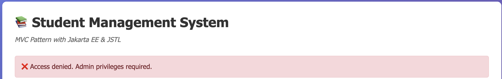
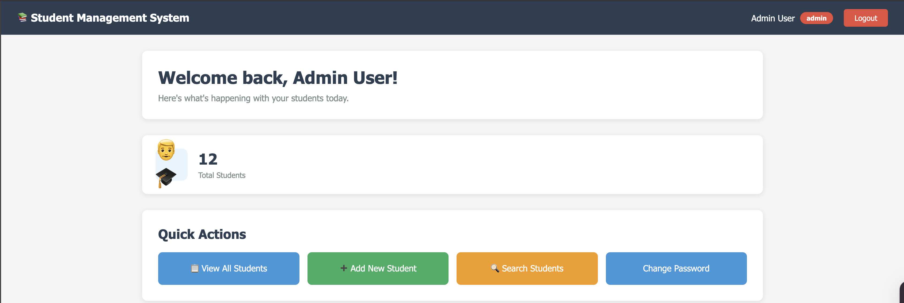

STUDENT INFORMATION:

Name: Pham Hoang Phuong

Student ID: ITCSIU23056

Class:    ITCS23IU41

COMPLETED EXERCISES:

[x] Exercise 1: Database & User

[x] Exercise 2: User Model & DAO

[x] Exercise 3: Login/Logout Controllers

[x] Exercise 4: Views & Dashboard

[x] Exercise 5: Authentication Filter

[x] Exercise 6: Admin Authorization Filter

[x] Exercise 7: Role-Based UI

[x] Exercise 8: Change Password

AUTHENTICATION COMPONENTS:

- Models: User.java
- DAOs: UserDAO.java
- Controllers: LoginController.java, LogoutController.java, DashboardController.java, ChangePasswordController.java
- Filters: AuthFilter.java, AdminFilter.java
- Views: login.jsp, dashboard.jsp, updated student-list.jsp

TEST CREDENTIALS:

Admin:

- Username: admin
- Password: password123

Regular User:

- Username: john
- Password: password123

Regular User:

- Username: jane
- Password: newpassword123

FEATURES IMPLEMENTED:

- User authentication with BCrypt
- Session management
- Login/Logout functionality
- Dashboard with statistics
- Authentication filter for protected pages
- Admin authorization filter
- Role-based UI elements
- Password security

SECURITY MEASURES:

- BCrypt password hashing
- Session regeneration after login
- Session timeout (30 minutes)
- SQL injection prevention (PreparedStatement)
- Input validation
- XSS prevention (JSTL escaping)

KNOWN ISSUES:

- [List any bugs or limitations]

BONUS FEATURES:

- [List any bonus features implemented]

TIME SPENT: 6 hours

TESTING NOTES:
[Describe how you tested authentication, filters, and authorization]

# Lab 6: AUTHENTICATION & SESSION MANAGEMENT

## EXERCISE 5: ADMIN AUTHORIZATION FILTER (10 points)

### Task 5.1: Create AuthFilter (12 points)

#### Implementation:

1. Created `AuthFilter.java` to intercept requests to protected resources.
2. Init the filter to check for user authentication and log the auth filter is initialized.
3. In `doFilter`, check if the user is logged in by verifying the session attribute.
4. Init the request from the user session.
5. Check the request URL is for protected resources.
6. If the user is not logged in, redirect to the login page.
7. If logged in, allow access to the requested resource.

#### Results:

```java

@WebFilter(filterName = "AuthFilter", urlPatterns = {"/*"})
public class AuthFilter implements Filter {
    @Override
    public void doFilter(ServletRequest request, ServletResponse response, FilterChain chain)
            throws IOException, ServletException {

        HttpServletRequest httpRequest = (HttpServletRequest) request;
        HttpServletResponse httpResponse = (HttpServletResponse) response;

        String requestURI = httpRequest.getRequestURI();
        String contextPath = httpRequest.getContextPath();
        String path = requestURI.substring(contextPath.length());

        // Check if this is a public URL
        if (isPublicUrl(path)) {
            // Allow access to public URLs
            chain.doFilter(request, response);
            return;
        }

        // Check if user is logged in
        HttpSession session = httpRequest.getSession(false);
        boolean isLoggedIn = (session != null && session.getAttribute("user") != null);

        if (isLoggedIn) {
            // User is logged in, allow access
            chain.doFilter(request, response);
        } else {
            // User not logged in, redirect to login
            String loginURL = contextPath + "/login";
            httpResponse.sendRedirect(loginURL);
        }
    }
}
```

## EXERCISE 6: ADMIN AUTHORIZATION FILTER (10 points)

### Task 6.1: Create AdminFilter (10 points)

#### Implementation:

1. Created `AdminFilter.java` to intercept requests to protected resources.
2. Init the filter to check for user authentication and log the auth filter is initialized.
3. In `doFilter`, check if the user is logged in by verifying the session attribute.
4. Init the request from the user session.
5. Check the request URL is for protected resources.
6. If not admin allow access to non-admin pages.
7. If the user is not logged in, redirect to the login page.
8. If logged in and admin, allow access to allow actions
9. If logged in and not admin, restrict access and error messages.

#### Results:

```java

@WebFilter(filterName = "AdminFilter", urlPatterns = {"/student"})
public class AdminFilter implements Filter {
    @Override
    public void doFilter(ServletRequest request, ServletResponse response, FilterChain chain)
            throws IOException, ServletException {

        HttpServletRequest httpRequest = (HttpServletRequest) request;
        HttpServletResponse httpResponse = (HttpServletResponse) response;

        String action = httpRequest.getParameter("action");

        // Check if this action requires admin role
        if (isAdminAction(action)) {
            HttpSession session = httpRequest.getSession(false);

            if (session != null) {
                User user = (User) session.getAttribute("user");

                if (user != null && user.isAdmin()) {
                    // User is admin, allow access
                    chain.doFilter(request, response);
                } else {
                    // User is not admin, deny access
                    httpResponse.sendRedirect(httpRequest.getContextPath() +
                            "/student?action=list&error=Access denied. Admin privileges required.");
                }
            } else {
                // No session, redirect to login
                httpResponse.sendRedirect(httpRequest.getContextPath() + "/login");
            }
        } else {
            // Not an admin action, allow access
            chain.doFilter(request, response);
        }
    }
}
```

#### Testing



## EXERCISE 7: ROLE-BASED UI (10 points)

### Task 7.1: Update Student List View (10 points)

#### Implementation:

1. Updated `student-list.jsp` to conditionally display admin actions based on user role.
2. Used JSTL to check if the logged-in user is an admin.
3. If the user is an admin, display "Add New Student", "Edit", and "Delete" buttons.
4. If the user is not an admin, hide these buttons.
5. Add navigation for admin and user and show the role in the dashboard.
6. Show error messages from AdminFilter

#### Results:

```jsp
<div class="navbar">
    <h2>📚 Student Management System</h2>
    <div class="navbar-right">
        <div class="user-info">
            <span>Welcome, ${sessionScope.fullName}</span>
            <span class="role-badge role-${sessionScope.role}">
                ${sessionScope.role}
            </span>
        </div>

        <a href="change-password" class="btn-nav">← Change password</a>
        <a href="dashboard" class="btn-nav">Dashboard</a>
        <a href="logout" class="btn-logout">Logout</a>
    </div>
</div>
```

```jsp
    <!-- Success Message -->
    <c:if test="${not empty param.message}">
        <div class="message success">
            ✅ ${param.message}
        </div>
    </c:if>

    <!-- Error Message -->
    <c:if test="${not empty param.error}">
        <div class="message error alert alert-error">
            ❌ ${param.error}
        </div>
    </c:if>

    <!-- Add New Student Button -->
    <c:if test="${sessionScope.role eq 'admin'}">
        <div style="margin: 20px 0;">
            <a href="student?action=new" class="btn-add btn btn-primary">➕ Add New Student</a>
        </div>
    </c:if>
```

```jsp
               <c:forEach var="student" items="${students}">
                    <tr>
                        <td>${student.id}</td>
                        <td><strong>${student.studentCode}</strong></td>
                        <td>${student.fullName}</td>
                        <td>${student.email}</td>
                        <td>${student.major}</td>
                        <c:if test="${sessionScope.role eq 'admin'}">
                            <td>
                                <div class="actions">
                                    <a href="${pageContext.request.contextPath}/student?action=edit&id=${student.id}"
                                       class="btn-edit btn btn-secondary">✏️Edit</a>
                                    <a href="${pageContext.request.contextPath}/student?action=delete&id=${student.id}"
                                       class="btn-delete btn btn-danger"
                                       onclick="return confirm('Are you sure you want to delete this student?')">🗑️Delete</a>
                                </div>
                            </td>
                        </c:if>
                    </tr>
                </c:forEach>
```

#### Testing


## EXERCISE 8: CHANGE PASSWORD (8 points)
### Task 8.1: Implement Change Password Feature (8 points)
1. Create `change-password.jsp` for the change password form.
2. Create `ChangePasswordController.java` to handle change password requests.
3. Check if the user is logged in.
4. Validate current password using BCrypt.
5. Validate new password and confirmation match.
6. Hash the new password with BCrypt and update it in the database.
7. Provide success or error messages.

#### Results:
```java 
package com.student.controller;
import com.student.dao.UserDAO;
import com.student.model.User;
import jakarta.servlet.ServletException;
import jakarta.servlet.annotation.WebServlet;
import jakarta.servlet.http.HttpServlet;
import jakarta.servlet.http.HttpServletRequest;
import jakarta.servlet.http.HttpServletResponse;
import jakarta.servlet.http.HttpSession;
import org.mindrot.jbcrypt.BCrypt;

import java.io.IOException;


@WebServlet("/change-password")
public class ChangePasswordController extends HttpServlet {
    private UserDAO userDAO;

    @Override
    public void init() {
        userDAO = new UserDAO();
    }

    @Override
    protected void doGet(HttpServletRequest request, HttpServletResponse response)
            throws ServletException, IOException {
        // Show change password form
        request.getRequestDispatcher("/views/change-password.jsp").forward(request, response);
    }

    @Override
    protected void doPost(HttpServletRequest request, HttpServletResponse response)
            throws ServletException, IOException {
        HttpSession session = request.getSession(false);
        if (session == null) {
            response.sendRedirect("login?message=Please+login+first");
            return;
        }

        // Get user object from session
        User sessionUser = (User) session.getAttribute("user");
        if (sessionUser == null) {
            response.sendRedirect("login?message=Please+login+first");
            return;
        }

        int userId = sessionUser.getId();
        System.out.println("User ID from session: " + userId);

        String currentPassword = request.getParameter("currentPassword");
        String newPassword = request.getParameter("newPassword");
        String confirmPassword = request.getParameter("confirmPassword");

        if (currentPassword == null || newPassword == null || confirmPassword == null) {
            request.setAttribute("error", "All fields are required.");
            request.getRequestDispatcher("/views/change-password.jsp").forward(request, response);
            return;
        }

        String storedHash = sessionUser.getPassword();

        // FIX: Use BCrypt.checkpw() to verify password
        if (!BCrypt.checkpw(currentPassword, storedHash)) {
            request.setAttribute("error", "Current password is incorrect.");
            request.getRequestDispatcher("/views/change-password.jsp").forward(request, response);
            return;
        }

        if (newPassword.length() < 8) {
            request.setAttribute("error", "New password must be at least 8 characters long.");
            request.getRequestDispatcher("/views/change-password.jsp").forward(request, response);
            return;
        }

        if (!newPassword.equals(confirmPassword)) {
            request.setAttribute("error", "New password and confirmation do not match.");
            request.getRequestDispatcher("/views/change-password.jsp").forward(request, response);
            return;
        }

        String newHash = BCrypt.hashpw(newPassword, BCrypt.gensalt());
        boolean updated = userDAO.updatePassword(userId, newHash);

        if (updated) {
            response.sendRedirect("change-password?message=Password+changed+successfully");
        } else {
            request.setAttribute("error", "Failed to update password. Please try again.");
            request.getRequestDispatcher("/views/change-password.jsp").forward(request, response);
        }
    }
}
```

#### Testing:
- Already change the jane password from password123 to newpassword123

