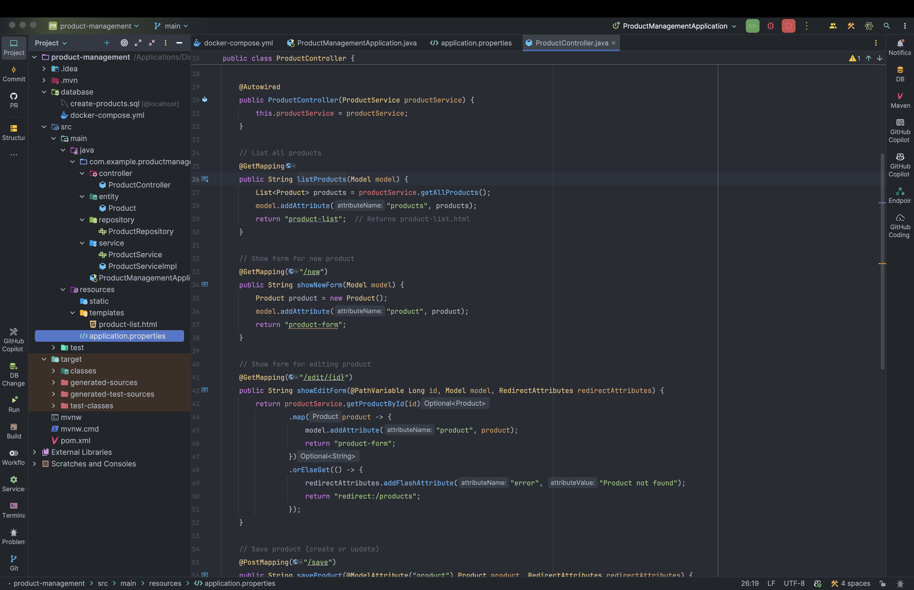
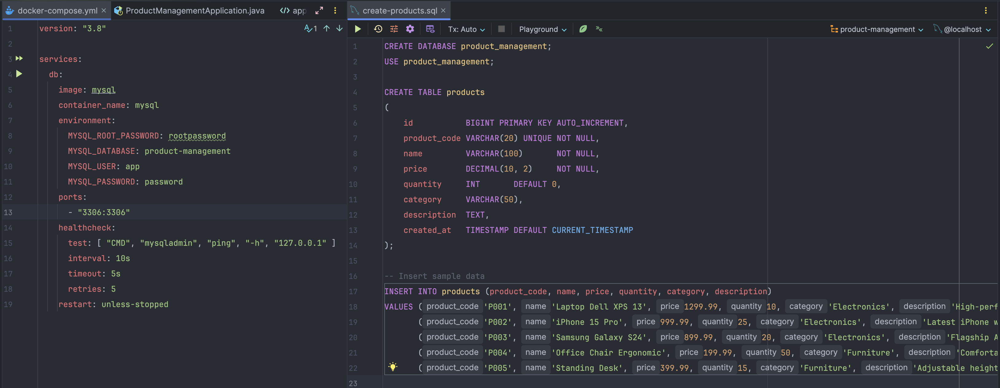
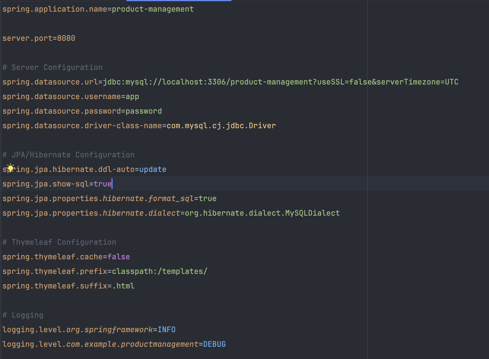
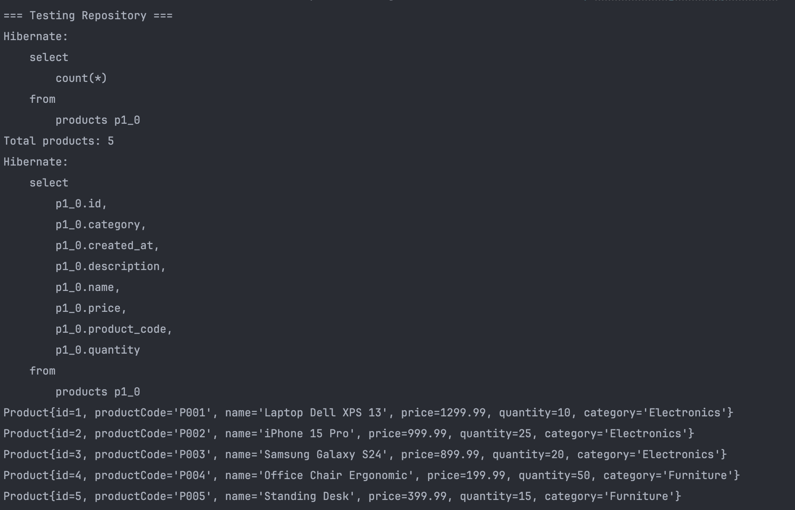
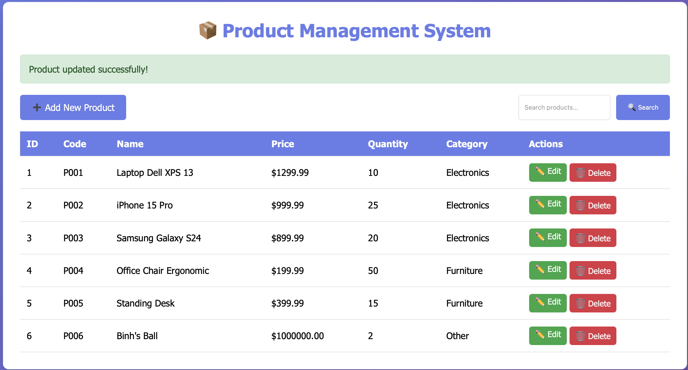
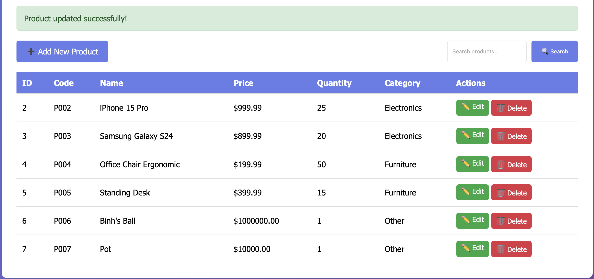
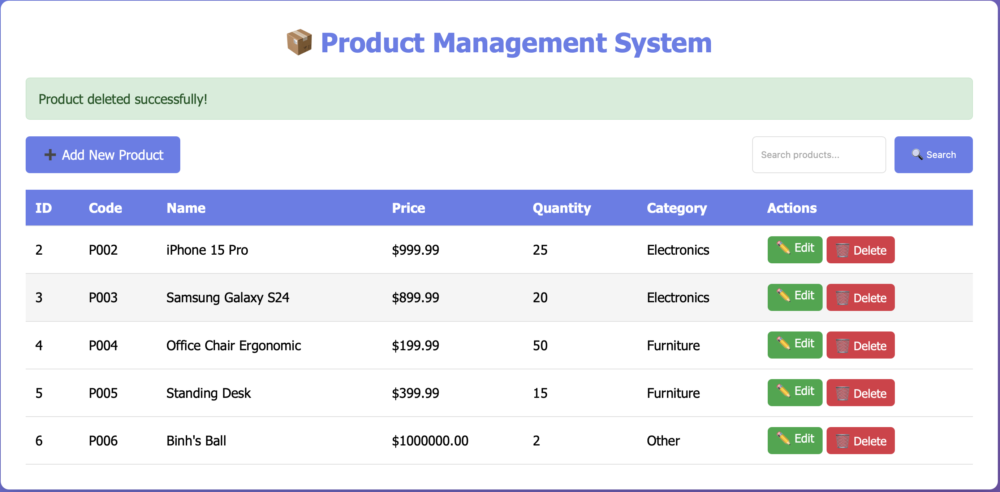

# LAB 7 EXERCISES SPRING BOOT & JPA CRUD

## EXERCISE 1 PROJECT SETUP & CONFIGURATION (15 points)

### Task 1.1 Create Spring Boot Project (5 points)

#### Implementation



### Task 1.2 Database Setup (5 points)

#### Implementation



### Task 1.3 Configure application.properties (5 points)

#### Implementation



## EXERCISE 2 ENTITY & REPOSITORY LAYERS (20 points)

### Task 2.1 Create Product Entity (10 points)

#### Implementation

```java
package com.example.productmanagement.entity;

import jakarta.persistence.*;
import lombok.Getter;
import lombok.Setter;

import java.math.BigDecimal;
import java.time.LocalDateTime;

@Setter
@Getter
@Entity
@Table(name = "products")

public class Product {

    // Getters and Setters
    @Id
    @GeneratedValue(strategy = GenerationType.IDENTITY)
    private Long id;

    @Column(name = "product_code", unique = true, nullable = false, length = 20)
    private String productCode;

    @Column(nullable = false, length = 100)
    private String name;

    @Column(nullable = false, precision = 10, scale = 2)
    private BigDecimal price;

    @Column(nullable = false)
    private Integer quantity;

    @Column(length = 50)
    private String category;

    @Column(columnDefinition = "TEXT")
    private String description;

    @Column(name = "created_at", updatable = false)
    private LocalDateTime createdAt;

    // Constructors
    public Product() {
    }

    public Product(String productCode, String name, BigDecimal price, Integer quantity, String category, String description) {
        this.productCode = productCode;
        this.name = name;
        this.price = price;
        this.quantity = quantity;
        this.category = category;
        this.description = description;
    }

    // Lifecycle callback
    @PrePersist
    protected void onCreate() {
        this.createdAt = LocalDateTime.now();
    }

    @Override
    public String toString() {
        return "Product{" +
                "id=" + id +
                ", productCode='" + productCode + '\'' +
                ", name='" + name + '\'' +
                ", price=" + price +
                ", quantity=" + quantity +
                ", category='" + category + '\'' +
                '}';
    }
}
```

### Task 2.2 Create Product Repository (5 points)

#### Implementation

```java
package com.example.productmanagement.repository;

import com.example.productmanagement.entity.Product;
import org.springframework.data.jpa.repository.JpaRepository;
import org.springframework.stereotype.Repository;

import java.math.BigDecimal;
import java.util.List;

@Repository
public interface ProductRepository extends JpaRepository<Product, Long> {

    // Spring Data JPA generates implementation automatically!

    // Custom query methods (derived from method names)
    List<Product> findByCategory(String category);

    List<Product> findByNameContaining(String keyword);

    List<Product> findByPriceBetween(BigDecimal minPrice, BigDecimal maxPrice);

    List<Product> findByCategoryOrderByPriceAsc(String category);

    boolean existsByProductCode(String productCode);
}
```

### Task 2.3 Test Repository (5 points)

#### Implementation



## EXERCISE 3 SERVICE LAYER (10 points)

### Task 3.1 Create Service Interface (3 points)

#### Implementation

```java
package com.example.productmanagement.service;

import com.example.productmanagement.entity.Product;

import java.util.List;
import java.util.Optional;

public interface ProductService {

    List<Product> getAllProducts();

    Optional<Product> getProductById(Long id);

    Product saveProduct(Product product);

    void deleteProduct(Long id);

    List<Product> searchProducts(String keyword);

    List<Product> getProductsByCategory(String category);
}
```

### Task 3.2 Implement Service (7 points)

#### Implementation

```java
package com.example.productmanagement.service;

import com.example.productmanagement.entity.Product;
import com.example.productmanagement.repository.ProductRepository;
import org.springframework.beans.factory.annotation.Autowired;
import org.springframework.stereotype.Service;
import org.springframework.transaction.annotation.Transactional;

import java.util.List;
import java.util.Optional;

@Service
@Transactional
public class ProductServiceImpl implements ProductService {

    private final ProductRepository productRepository;

    @Autowired
    public ProductServiceImpl(ProductRepository productRepository) {
        this.productRepository = productRepository;
    }

    @Override
    public List<Product> getAllProducts() {
        return productRepository.findAll();
    }

    @Override
    public Optional<Product> getProductById(Long id) {
        return productRepository.findById(id);
    }

    @Override
    public Product saveProduct(Product product) {
        // Validation logic can go here
        return productRepository.save(product);
    }

    @Override
    public void deleteProduct(Long id) {
        productRepository.deleteById(id);
    }

    @Override
    public List<Product> searchProducts(String keyword) {
        return productRepository.findByNameContaining(keyword);
    }

    @Override
    public List<Product> getProductsByCategory(String category) {
        return productRepository.findByCategory(category);
    }
}
```

## EXERCISE 4 CONTROLLER & VIEWS (15 points)

### Task 4.1 Create Product Controller (8 points)

#### Implementation

```java
package com.example.productmanagement.controller;

import com.example.productmanagement.entity.Product;
import com.example.productmanagement.service.ProductService;
import org.springframework.beans.factory.annotation.Autowired;
import org.springframework.stereotype.Controller;
import org.springframework.ui.Model;
import org.springframework.web.bind.annotation.*;
import org.springframework.web.servlet.mvc.support.RedirectAttributes;

import java.util.List;

@Controller
@RequestMapping("/products")
public class ProductController {

    private final ProductService productService;

    @Autowired
    public ProductController(ProductService productService) {
        this.productService = productService;
    }

    // List all products
    @GetMapping
    public String listProducts(Model model) {
        List<Product> products = productService.getAllProducts();
        model.addAttribute("products", products);
        return "product-list";  // Returns product-list.html
    }

    // Show form for new product
    @GetMapping("/new")
    public String showNewForm(Model model) {
        Product product = new Product();
        model.addAttribute("product", product);
        return "product-form";
    }

    // Show form for editing product
    @GetMapping("/edit/{id}")
    public String showEditForm(@PathVariable Long id, Model model, RedirectAttributes redirectAttributes) {
        return productService.getProductById(id)
                .map(product -> {
                    model.addAttribute("product", product);
                    return "product-form";
                })
                .orElseGet(() -> {
                    redirectAttributes.addFlashAttribute("error", "Product not found");
                    return "redirect/products";
                });
    }

    // Save product (create or update)
    @PostMapping("/save")
    public String saveProduct(@ModelAttribute("product") Product product, RedirectAttributes redirectAttributes) {
        try {
            productService.saveProduct(product);
            redirectAttributes.addFlashAttribute("message",
                    product.getId() == null ? "Product added successfully!"  "Product updated successfully!");
        } catch (Exception e) {
            redirectAttributes.addFlashAttribute("error", "Error saving product " + e.getMessage());
        }
        return "redirect/products";
    }

    // Delete product
    @GetMapping("/delete/{id}")
    public String deleteProduct(@PathVariable Long id, RedirectAttributes redirectAttributes) {
        try {
            productService.deleteProduct(id);
            redirectAttributes.addFlashAttribute("message", "Product deleted successfully!");
        } catch (Exception e) {
            redirectAttributes.addFlashAttribute("error", "Error deleting product " + e.getMessage());
        }
        return "redirect/products";
    }

    // Search products
    @GetMapping("/search")
    public String searchProducts(@RequestParam("keyword") String keyword, Model model) {
        List<Product> products = productService.searchProducts(keyword);
        model.addAttribute("products", products);
        model.addAttribute("keyword", keyword);
        return "product-list";
    }
}
```

### Task 4.2 Create Product List View (4 points)

#### Implementation

```html
<!DOCTYPE html>
<html xmlnsth="http//www.thymeleaf.org" lang="en">
<head>
    <meta charset="UTF-8">
    <meta name="viewport" content="width=device-width, initial-scale=1.0">
    <title>Product Management</title>
    <style>
        * {
            margin 0;
            padding 0;
            box-sizing border-box;
        }

        body {
            font-family 'Segoe UI', Tahoma, Geneva, Verdana, sans-serif;
            background linear-gradient(135deg, #667eea 0%, #764ba2 100%);
            min-height 100vh;
            padding 20px;
        }

        .container {
            max-width 1200px;
            margin 0 auto;
            background white;
            border-radius 10px;
            padding 30px;
            box-shadow 0 10px 30px rgba(0,0,0,0.2);
        }

        h1 {
            color #667eea;
            margin-bottom 20px;
            text-align center;
        }

        .alert {
            padding 15px;
            margin-bottom 20px;
            border-radius 5px;
        }

        .alert-success {
            background-color #d4edda;
            color #155724;
            border 1px solid #c3e6cb;
        }

        .alert-error {
            background-color #f8d7da;
            color #721c24;
            border 1px solid #f5c6cb;
        }

        .actions {
            display flex;
            justify-content space-between;
            margin-bottom 20px;
            flex-wrap wrap;
            gap 10px;
        }

        .btn {
            padding 10px 20px;
            border none;
            border-radius 5px;
            cursor pointer;
            text-decoration none;
            display inline-block;
            transition all 0.3s;
        }

        .btn-primary {
            background-color #667eea;
            color white;
        }

        .btn-primaryhover {
            background-color #5568d3;
        }

        .btn-success {
            background-color #28a745;
            color white;
        }

        .btn-danger {
            background-color #dc3545;
            color white;
        }

        .btn-sm {
            padding 5px 10px;
            font-size 14px;
        }

        .search-form {
            display flex;
            gap 10px;
        }

        .search-form input {
            padding 10px;
            border 1px solid #ddd;
            border-radius 5px;
            flex 1;
        }

        table {
            width 100%;
            border-collapse collapse;
            margin-top 20px;
        }

        th, td {
            padding 12px;
            text-align left;
            border-bottom 1px solid #ddd;
        }

        th {
            background-color #667eea;
            color white;
        }

        trhover {
            background-color #f5f5f5;
        }

        .empty-state {
            text-align center;
            padding 40px;
            color #666;
        }

        .actions-column {
            display flex;
            gap 5px;
        }
    </style>
</head>
<body>
<div class="container">
    <h1>📦 Product Management System</h1>

    <!-- Success Message -->
    <div thif="${message}" class="alert alert-success">
        <span thtext="${message}"></span>
    </div>

    <!-- Error Message -->
    <div thif="${error}" class="alert alert-error">
        <span thtext="${error}"></span>
    </div>

    <!-- Actions -->
    <div class="actions">
        <a thhref="@{/products/new}" class="btn btn-primary">➕ Add New Product</a>

        <form thaction="@{/products/search}" method="get" class="search-form">
            <input type="text" name="keyword" thvalue="${keyword}" placeholder="Search products..." />
            <button type="submit" class="btn btn-primary">🔍 Search</button>
        </form>
    </div>

    <!-- Products Table -->
    <div thif="${products != null and !products.isEmpty()}">
        <table>
            <thead>
            <tr>
                <th>ID</th>
                <th>Code</th>
                <th>Name</th>
                <th>Price</th>
                <th>Quantity</th>
                <th>Category</th>
                <th>Actions</th>
            </tr>
            </thead>
            <tbody>
            <tr theach="product  ${products}">
                <td thtext="${product.id}">1</td>
                <td thtext="${product.productCode}">P001</td>
                <td thtext="${product.name}">Product Name</td>
                <td thtext="'$' + ${#numbers.formatDecimal(product.price, 1, 2)}">$99.99</td>
                <td thtext="${product.quantity}">10</td>
                <td thtext="${product.category}">Electronics</td>
                <td>
                    <div class="actions-column">
                        <a thhref="@{/products/edit/{id}(id=${product.id})}" class="btn btn-success btn-sm">✏️ Edit</a>
                        <a thhref="@{/products/delete/{id}(id=${product.id})}"
                           class="btn btn-danger btn-sm"
                           onclick="return confirm('Are you sure you want to delete this product?')">
                            🗑️ Delete
                        </a>
                    </div>
                </td>
            </tr>
            </tbody>
        </table>
    </div>

    <!-- Empty State -->
    <div thif="${products == null or products.isEmpty()}" class="empty-state">
        <p>No products found. Add your first product!</p>
    </div>
</div>
</body>
</html>
```

### Task 4.3 Create Product Form View (3 points)

#### Implementation

```html
<!DOCTYPE html>
<html xmlnsth="http//www.thymeleaf.org">
<head>
    <meta charset="UTF-8">
    <meta name="viewport" content="width=device-width, initial-scale=1.0">
    <title>Product Form</title>
    <style>
        * {
            margin 0;
            padding 0;
            box-sizing border-box;
        }

        body {
            font-family 'Segoe UI', Tahoma, Geneva, Verdana, sans-serif;
            background linear-gradient(135deg, #667eea 0%, #764ba2 100%);
            min-height 100vh;
            padding 20px;
        }

        .container {
            max-width 600px;
            margin 0 auto;
            background white;
            border-radius 10px;
            padding 30px;
            box-shadow 0 10px 30px rgba(0,0,0,0.2);
        }

        h1 {
            color #667eea;
            margin-bottom 30px;
            text-align center;
        }

        .form-group {
            margin-bottom 20px;
        }

        label {
            display block;
            margin-bottom 5px;
            color #333;
            font-weight 500;
        }

        input, select, textarea {
            width 100%;
            padding 10px;
            border 1px solid #ddd;
            border-radius 5px;
            font-size 14px;
        }

        textarea {
            resize vertical;
            min-height 100px;
        }

        .btn {
            padding 12px 30px;
            border none;
            border-radius 5px;
            cursor pointer;
            text-decoration none;
            display inline-block;
            margin-right 10px;
            transition all 0.3s;
        }

        .btn-primary {
            background-color #667eea;
            color white;
        }

        .btn-primaryhover {
            background-color #5568d3;
        }

        .btn-secondary {
            background-color #6c757d;
            color white;
        }

        .btn-secondaryhover {
            background-color #5a6268;
        }

        .button-group {
            margin-top 30px;
            display flex;
            justify-content center;
        }
    </style>
</head>
<body>
<div class="container">
    <h1 thtext="${product.id != null} ? '✏️ Edit Product'  '➕ Add New Product'">Product Form</h1>

    <form thaction="@{/products/save}" thobject="${product}" method="post">
        <!-- Hidden ID field for updates -->
        <input type="hidden" thfield="*{id}" />

        <div class="form-group">
            <label for="productCode">Product Code *</label>
            <input type="text"
                   id="productCode"
                   thfield="*{productCode}"
                   placeholder="Enter product code (e.g., P001)"
                   required />
        </div>

        <div class="form-group">
            <label for="name">Product Name *</label>
            <input type="text"
                   id="name"
                   thfield="*{name}"
                   placeholder="Enter product name"
                   required />
        </div>

        <div class="form-group">
            <label for="price">Price ($) *</label>
            <input type="number"
                   id="price"
                   thfield="*{price}"
                   step="0.01"
                   min="0"
                   placeholder="0.00"
                   required />
        </div>

        <div class="form-group">
            <label for="quantity">Quantity *</label>
            <input type="number"
                   id="quantity"
                   thfield="*{quantity}"
                   min="0"
                   placeholder="0"
                   required />
        </div>

        <div class="form-group">
            <label for="category">Category *</label>
            <select id="category" thfield="*{category}" required>
                <option value="">Select category</option>
                <option value="Electronics">Electronics</option>
                <option value="Furniture">Furniture</option>
                <option value="Clothing">Clothing</option>
                <option value="Books">Books</option>
                <option value="Food">Food</option>
                <option value="Other">Other</option>
            </select>
        </div>

        <div class="form-group">
            <label for="description">Description</label>
            <textarea id="description"
                      thfield="*{description}"
                      placeholder="Enter product description (optional)"></textarea>
        </div>

        <div class="button-group">
            <button type="submit" class="btn btn-primary">💾 Save Product</button>
            <a thhref="@{/products}" class="btn btn-secondary">❌ Cancel</a>
        </div>
    </form>
</div>
</body>
</html>
```

## Explanation of CREATE code flow

### How does it work?

1. **User Submission** The user fills out the product form on the web page and clicks the "Save Product" button. This action triggers an HTTP POST request to the server with the form data.
2. **Controller Handling** The Spring Boot application receives the POST request and routes it to the appropriate controller method based on the URL mapping. In this case, the `saveProduct` method in `ProductController` is invoked.
3. **Data Binding** The form data is automatically bound to a `Product` object using the `@ModelAttribute` annotation. Spring Boot populates the fields of the `Product` object with the data submitted from the form.
4. **Service Layer Interaction** The controller method calls the `saveProduct` method of the `ProductService`, passing the populated `Product` object to it.
5. **Repository Layer Interaction** The service layer interacts with the `ProductRepository`, which uses JPA to save the product data to the database.
6. **Data Persistence** The repository saves the product data to the database.
7. **Success Handling** If the save operation is successful, the service layer returns the saved `Product` object back to the controller.
8. **Redirect with Message** The controller adds a success message to the `RedirectAttributes` and redirects the user to the product list page (`/products`).
9. **HTTP Response** The server sends an HTTP redirect response to the user's web browser.
10. **Follow Redirect** The user's web browser follows the redirect and sends a new HTTP GET request to the `/products` URL to display the updated product list.
11. **Display Updated List** The product list page is rendered again, now including the newly added product, along with the success message.

### Results



## Explanation of UPDATE code flow

### How does it work?

1. **User Submission** The user fills out the product form on the web page and clicks the "Save Product" button. This action triggers an HTTP POST request to the server with the form data.
2. **Controller Handling** The Spring Boot application receives the POST request and routes it to the appropriate controller method based on the URL mapping. In this case, the `saveProduct` method in `ProductController` is invoked.
3. **Data Binding** The form data is automatically bound to a `Product` object using the `@ModelAttribute` annotation. Spring Boot populates the fields of the `Product` object with the data submitted from the form.
4. **Service Layer Interaction** The controller method calls the `saveProduct` method of the `ProductService`, passing the populated `Product` object to it.
5. **Repository Layer Interaction** The service layer interacts with the `ProductRepository`, which uses JPA to save the product data to the database.
6. **Data Persistence** The repository saves the product data to the database.
7. **Success Handling** If the save operation is successful, the service layer returns the saved `Product` object back to the controller.
8. **Redirect with Message** The controller adds a success message to the `RedirectAttributes` and redirects the user to the product list page (`/products`).
9. **HTTP Response** The server sends an HTTP redirect response to the user's web browser.
10. **Follow Redirect** The user's web browser follows the redirect and sends a new HTTP GET request to the `/products` URL to display the updated product list.
11. **Display Updated List** The product list page is rendered again, now including the newly added or updated product, along with the success message.

### Results



## Explanation of DELETE code flow

### How does it work?

1. **User Action** The user clicks the "Delete" button next to a product in the product list. This action triggers an HTTP GET request to the server with the product ID in the URL (e.g., `/products/delete/{id}`).
2. **Controller Handling** The Spring Boot application receives the GET request and routes it to the appropriate controller method based on the URL mapping. In this case, the `deleteProduct` method in `ProductController` is invoked.
3. **Service Layer Interaction** The controller method calls the `deleteProduct` method of the `ProductService`, passing the product ID to it.
4. **Repository Layer Interaction** The service layer interacts with the `ProductRepository`, which uses JPA to delete the product from the database.
5. **Data Deletion** The repository deletes the product with the specified ID from the database.
6. **Success Handling** If the delete operation is successful, the service layer returns control back to the controller.
7. **Redirect with Message** The controller adds a success message to the `RedirectAttributes` and redirects the user to the product list page (`/products`).
8. **HTTP Response** The server sends an HTTP redirect response to the user's web browser.
9. **Follow Redirect** The user's web browser follows the redirect and sends a new HTTP GET request to the `/products` URL to display the updated product list.
10. **Display Updated List** The product list page is rendered again, now excluding the deleted product, along with the success message.

### Results


