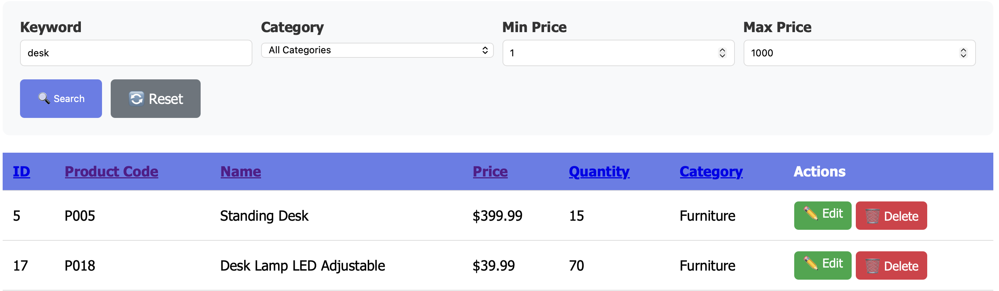
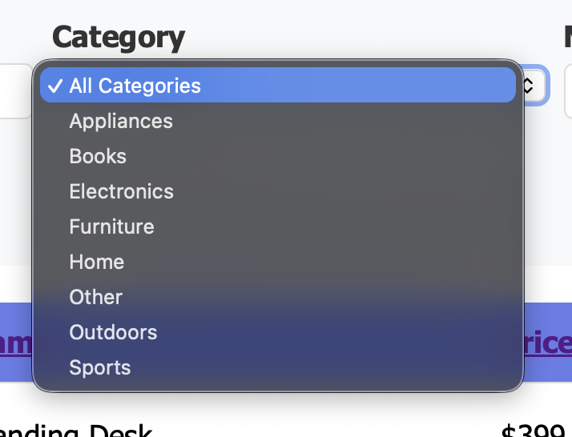
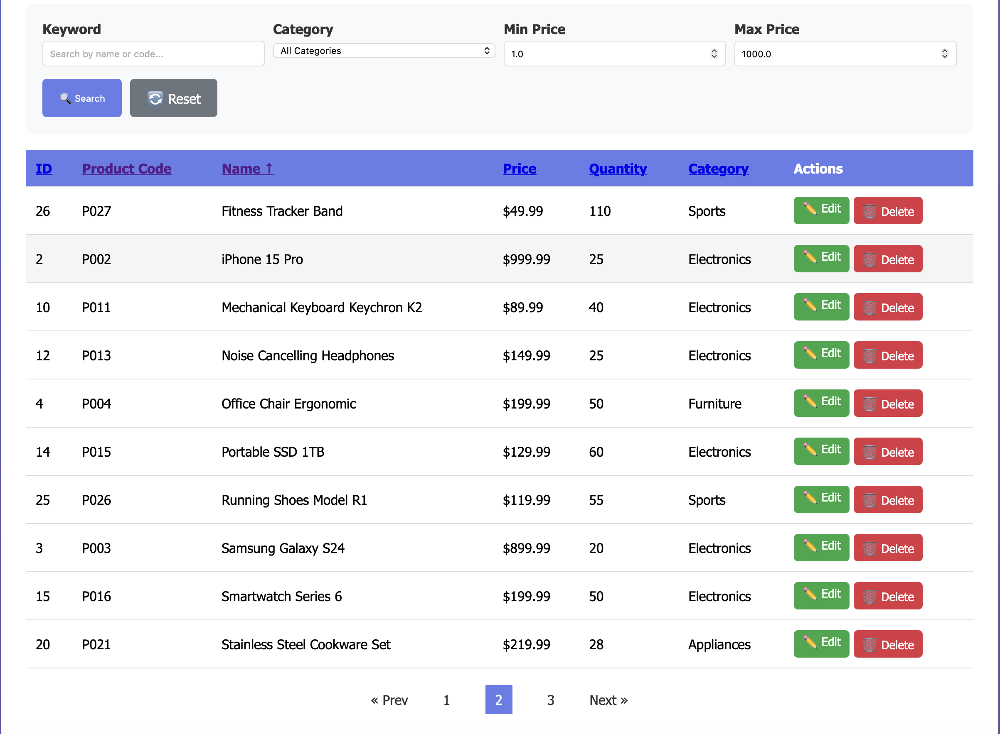
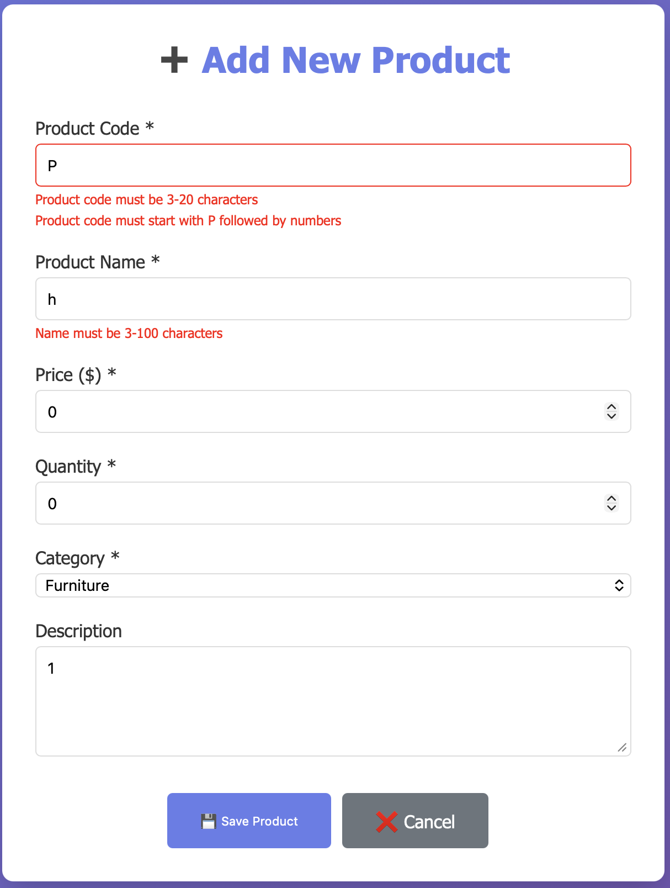
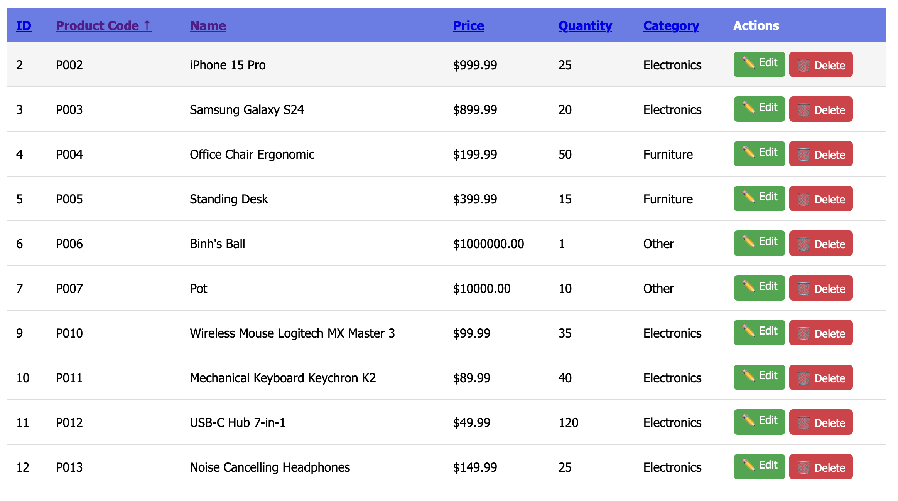
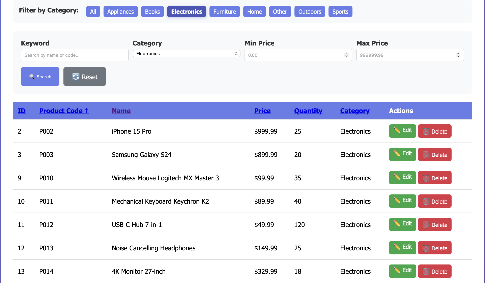
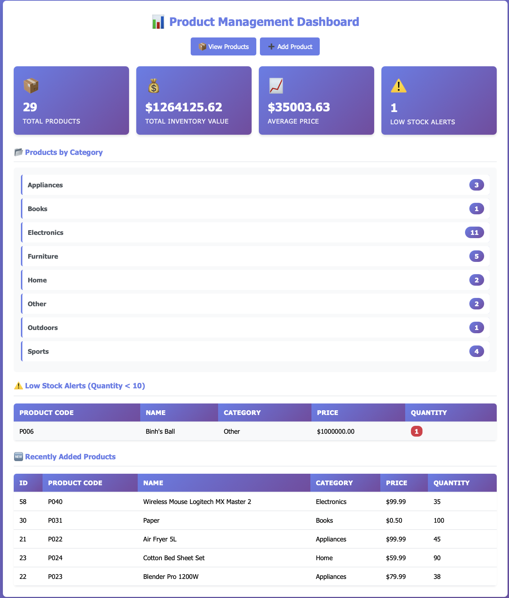
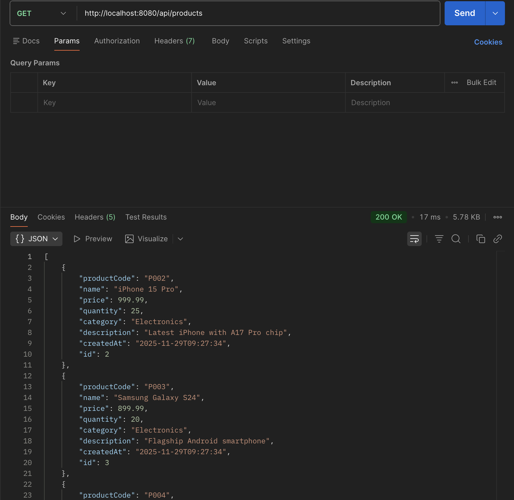
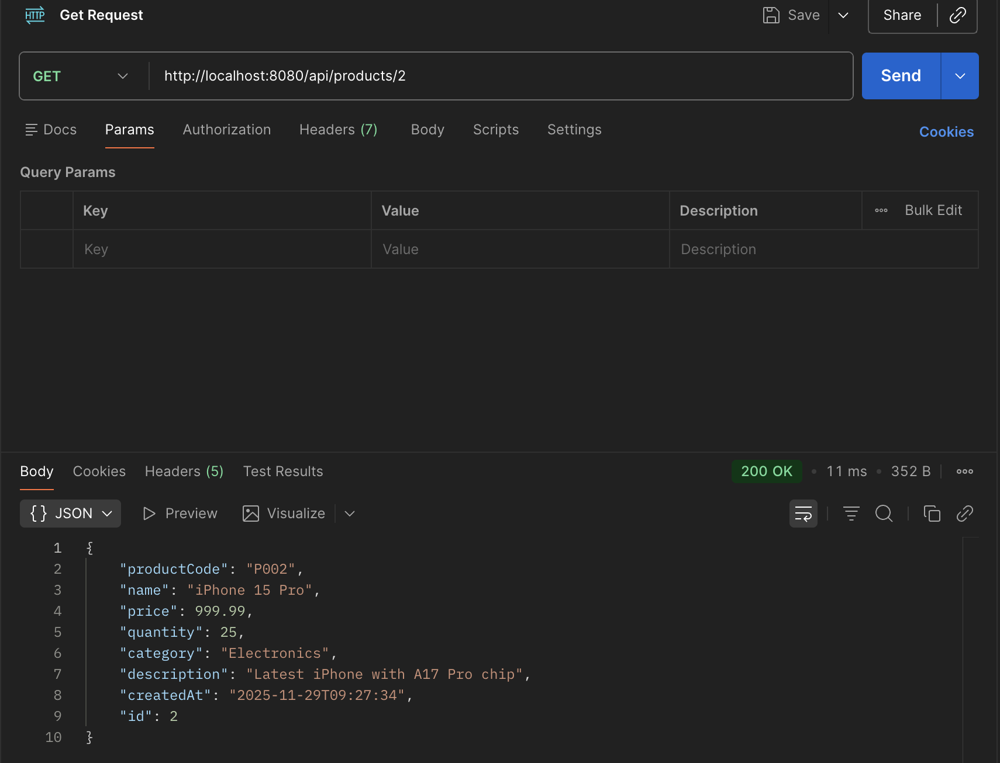

# Product Management System

## Student Information

- Name: Pham Hoang Phuong
- Student ID: ITCSIU23056
- Class: ITCS23IU41

## Technologies Used

- Spring Boot 3.3.x
- Spring Data JPA
- MySQL 8.0
- Thymeleaf
- Maven

## Setup Instructions

1. Import project into VS Code
2. Create database: `product_management`
3. Update `application.properties` with your MySQL credentials
4. Run: `mvn spring-boot:run`
5. Open browser: http://localhost:8080/products

## Completed Features

- [x] CRUD operations
- [x] Search functionality
- [x] Advanced search with filters
- [x] Validation
- [x] Sorting
- [x] Pagination
- [x] REST API (Bonus)

## Project Structure

- entity/ - JPA entities
- repository/ - Data access layer
- service/ - Business logic layer
- controller/ - Web controllers
- templates/ - Thymeleaf views

## Database Schema

- Table: products

## Known Issues

- None

## Time Spent

Approximately 6 hours

## Screenshots

See `screenshots/` folder.

## EXERCISE 5: ADVANCED SEARCH (12 points)

### Task 5.1: Multi-Criteria Search (6 points)

### How does it work?

1. Create the function is the repository layer to support multi-criteria search with annotation `@Query` to handle the
   SQL.
2. In the service layer, create a method to call the repository method and return the results.
3. In the controller layer, create a method to handle the search request and return the results to the view.
4. In the view layer, create a form to input search criteria and display the results.

#### Code Implementation

##### Repository Layer

```java

@Query("SELECT p FROM Product p WHERE " +
        "(:name IS NULL OR :name = '' OR " +
        "LOWER(p.name) LIKE LOWER(CONCAT('%', :name, '%'))) AND " +
        "(:category IS NULL OR :category = '' OR p.category = :category) AND " +
        "(:minPrice IS NULL OR p.price >= :minPrice) AND " +
        "(:maxPrice IS NULL OR p.price <= :maxPrice)")
Page<Product> searchProducts(@Param("name") String name,
                             @Param("category") String category,
                             @Param("minPrice") BigDecimal minPrice,
                             @Param("maxPrice") BigDecimal maxPrice,
                             Pageable pageable);
```

##### Service Layer

```java

@Override
public Page<Product> advancedSearch(
        String keyword,
        String category,
        BigDecimal minPrice,
        BigDecimal maxPrice,
        Pageable pageable) {
    return productRepository.searchProducts(keyword, category, minPrice, maxPrice, pageable);
}
```

##### Controller Layer

```java

@GetMapping("/advanced-search")
public String advancedSearch(
        @RequestParam(required = false) String keyword,
        @RequestParam(required = false) String category,
        @RequestParam(required = false) BigDecimal minPrice,
        @RequestParam(required = false) BigDecimal maxPrice,
        Model model,
        @RequestParam(defaultValue = "0") int page,
        @RequestParam(defaultValue = "10") int size) {

    Pageable pageable = PageRequest.of(page, size);
    Page<Product> productPage = productService.advancedSearch(keyword, category, minPrice, maxPrice, pageable);
    model.addAttribute("products", productPage.getContent());
    model.addAttribute("categories", productService.findAllCategories());
    model.addAttribute("keyword", keyword);
    model.addAttribute("category", category);
    model.addAttribute("minPrice", minPrice);
    model.addAttribute("maxPrice", maxPrice);

    model.addAttribute("currentPage", page);
    model.addAttribute("totalPages", productPage.getTotalPages());
    model.addAttribute("size", size);
    model.addAttribute("searchType", "search");
    return "product-list";
}
```

##### View Layer (Thymeleaf)

```html

<form th:action="@{/products/advanced-search}" method="get" class="search-form advanced-search-form"
      onchange="this.form.submit()">
    <div class="grid">
        <div>
            <label>Keyword</label>
            <input type="text" name="keyword" th:value="${keyword}" placeholder="Search by name or code..." />
        </div>

        <div>
            <label>Category</label>
            <select name="category">
                <option value="">All Categories</option>
                <option th:each="cat : ${categories}"
                        th:value="${cat}"
                        th:text="${cat}"
                        th:selected="${cat == selectedCategory}">
                </option>
            </select>
        </div>

        <div>
            <label>Min Price</label>
            <input type="number" name="minPrice" th:value="${minPrice}" placeholder="0.00" step="0.01" />
        </div>

        <div>
            <label>Max Price</label>
            <input type="number" name="maxPrice" th:value="${maxPrice}" placeholder="999999.99" step="0.01" />
        </div>
    </div>
    <div class="actions-row">
        <button type="submit" class="btn btn-primary">🔍 Search</button>
        <a th:href="@{/products}" class="btn btn-reset">🔄 Reset</a>
    </div>
</form>
```

#### Screenshots



### Task 5.2: Category Filter (3 points)

#### How does it work?

1. In `ProductRepository`, create a method to get all categories.
2. In `ProductService`, create a method to call the repository method and return the list of categories.
3. In the controller layer, call the service method to get categories and add them to the model.
4. In the view layer, create a dropdown to select categories for filtering.

#### Code Implementation

##### Repository Layer

```java

@Query("SELECT DISTINCT p.category FROM Product p")
List<String> findAllCategories();
```

##### Service Layer

```java

@Override
public List<String> findAllCategories() {
    return productRepository.findAllCategories();
}
```

##### Controller Layer

```java
    model.addAttribute("categories",productService.findAllCategories());
```

##### View Layer (Thymeleaf)

```html
    <select name="category">
    <option value="">All Categories</option>
    <option th:each="cat : ${categories}"
            th:value="${cat}"
            th:text="${cat}"
            th:selected="${cat == selectedCategory}">
    </option>
</select>
```

#### Screenshots



### Task 5.3: Search with Pagination (3 points)

#### How does it work?

1. Modify the repository method to return a `Page<Product>` instead of a `List<Product>`.
2. In the service layer, update the method to accept a `Pageable` parameter and return a `Page<Product>`.
3. In the controller layer, accept pagination parameters and create a `Pageable` object to pass to the service method.
4. In the view layer, update the pagination links to include search parameters. Implementation

##### Repository Layer

```java
    Page<Product> searchProducts(@Param("name") String name,
                                 @Param("category") String category,
                                 @Param("minPrice") BigDecimal minPrice,
                                 @Param("maxPrice") BigDecimal maxPrice,
                                 Pageable pageable);
``` 

##### Service Layer

```java
    public Page<Product> advancedSearch(
        String keyword,
        String category,
        BigDecimal minPrice,
        BigDecimal maxPrice,
        Pageable pageable) {
    return productRepository.searchProducts(keyword, category, minPrice, maxPrice, pageable);
}
```

##### Controller Layer

```java

@GetMapping("/advanced-search")
public String advancedSearch(
        @RequestParam(required = false) String keyword,
        @RequestParam(required = false) String category,
        @RequestParam(required = false) BigDecimal minPrice,
        @RequestParam(required = false) BigDecimal maxPrice,
        Model model,
        @RequestParam(defaultValue = "0") int page,
        @RequestParam(defaultValue = "10") int size) {

    Pageable pageable = PageRequest.of(page, size);
    Page<Product> productPage = productService.advancedSearch(keyword, category, minPrice, maxPrice, pageable);
    model.addAttribute("products", productPage.getContent());
    model.addAttribute("categories", productService.findAllCategories());
    model.addAttribute("keyword", keyword);
    model.addAttribute("category", category);
    model.addAttribute("minPrice", minPrice);
    model.addAttribute("maxPrice", maxPrice);

    model.addAttribute("currentPage", page);
    model.addAttribute("totalPages", productPage.getTotalPages());
    model.addAttribute("size", size);
    model.addAttribute("searchType", "search");
    return "product-list";
}
```

##### View Layer (Thymeleaf)

```html

<div class="pagination" th:if="${totalPages > 1}">
    <!-- Prev -->
    <span th:if="${currentPage <= 0}" class="disabled">« Prev</span>
    <a th:if="${currentPage > 0}"
       th:href="@{/products(keyword=${keyword},category=${selectedCategory},minPrice=${minPrice},maxPrice=${maxPrice},sortBy=${sortBy},sortDir=${sortDir},page=${currentPage - 1},size=${size})}">
        « Prev
    </a>

    <!-- Page numbers -->
    <span th:each="i : ${#numbers.sequence(0, totalPages - 1)}">
                <a th:if="${i != currentPage}"
                   th:href="@{/products(keyword=${keyword},category=${selectedCategory},minPrice=${minPrice},maxPrice=${maxPrice},sortBy=${sortBy},sortDir=${sortDir},page=${i},size=${size})}"
                   th:text="${i + 1}">1</a>

                <span th:if="${i == currentPage}" class="active" th:text="${i + 1}">1</span>
            </span>

    <!-- Next -->
    <a th:if="${currentPage < totalPages - 1}"
       th:href="@{/products(keyword=${keyword},category=${selectedCategory},minPrice=${minPrice},maxPrice=${maxPrice},sortBy=${sortBy},sortDir=${sortDir},page=${currentPage + 1},size=${size})}">
        Next »
    </a>
    <span th:if="${currentPage >= totalPages - 1}" class="disabled">Next »</span>
</div>
```

#### Screenshots



## EXERCISE 6: VALIDATION (10 points)

### Task 6.1: Add Validation Annotations (5 points)

#### How does it work?

1. In the `Product` entity, add validation annotations to the fields.
2. Use annotations like `@NotBlank`, `@Size`, `@DecimalMin`, and `@DecimalMax` to enforce validation rules.

#### Code Implementation

```java    

@NotBlank(message = "Product code is required")
@Size(min = 3, max = 20, message = "Product code must be 3-20 characters")
@Pattern(regexp = "^P\\d{3,}$", message = "Product code must start with P followed by numbers")
@Column(name = "product_code", unique = true, nullable = false, length = 20)
private String productCode;

@NotBlank(message = "Product name is required")
@Size(min = 3, max = 100, message = "Name must be 3-100 characters")
@Column(nullable = false, length = 100)
private String name;


@NotNull(message = "Price is required")
@DecimalMin(value = "0.01", message = "Price must be greater than 0")
@DecimalMax(value = "999999.99", message = "Price is too high")
@Column(nullable = false, precision = 10, scale = 2)
private BigDecimal price;

@NotNull(message = "Quantity is required")
@Min(value = 0, message = "Quantity cannot be negative")
@Column(nullable = false)
private Integer quantity;

@NotBlank(message = "Category is required")
@Column(length = 50)
private String category;
```

### Task 6.2: Add Validation in Controller (3 points)

#### How does it work?

1. In the controller methods that handle form submissions, use `@Valid` to trigger validation.
2. Use `BindingResult` to check for validation errors and handle them appropriately.
3. If there are errors, return to the form view with error messages.
4. If validation passes, proceed with saving the product.

#### Code Implementation

```java

@PostMapping("/save")
public String saveProduct(
        @Valid @ModelAttribute("product") Product product,
        BindingResult result,
        RedirectAttributes redirectAttributes) {

    if (result.hasErrors()) {
        return "product-form";
    }

    try {
        productService.saveProduct(product);
        redirectAttributes.addFlashAttribute("message", "Product saved successfully!");
    } catch (Exception e) {
        redirectAttributes.addFlashAttribute("error", "Error: " + e.getMessage());
    }

    return "redirect:/products";
}
```

### Task 6.3: Display Validation Errors (2 points)

#### How does it work?

1. In the Thymeleaf form view, use `th:errors` to display validation error messages next to the corresponding input
   fields.
2. Ensure that the form retains user input when validation errors occur.

#### Code Implementation

```html

<div>
    <label>Product Code</label>
    <input type="text" th:field="*{productCode}" placeholder="Enter product code" />
    <div class="error" th:if="${#fields.hasErrors('productCode')}" th:errors="*{productCode}"></div>
</div>

<div>
    <label>Name</label>
    <input type="text" th:field="*{name}" placeholder="Enter product name" />
    <div class="error" th:if="${#fields.hasErrors('name')}" th:errors="*{name}"></div>
</div>

<div>
    <label>Price</label>
    <input type="number" step="0.01" th:field="*{price}" placeholder="Enter price" />
    <div class="error" th:if="${#fields.hasErrors('price')}" th:errors="*{price}"></div>
</div>

<div>
    <label>Quantity</label>
    <input type="number" th:field="*{quantity}" placeholder="Enter quantity" />
    <div class="error" th:if="${#fields.hasErrors('quantity')}" th:errors="*{quantity}"></div>
</div>

<div>
    <label>Category</label>
    <input type="text" th:field="*{category}" placeholder="Enter category" />
    <div class="error" th:if="${#fields.hasErrors('category')}" th:errors="*{category}"></div>
</div>
```

#### Screenshots



## EXERCISE 7: SORTING & FILTERING (10 points)

### Task 7.1: Add Sorting (5 points)

#### How does it work?

1. In the controller layer, accept sorting parameters (`sortBy` and `sortDir`) from the request.
2. Create a `Sort` object based on the parameters and pass it to the `Pageable` object.
3. In the view layer, create clickable column headers that link to the sorted product list.

#### Code Implementation

##### Controller Layer

```java

@GetMapping
public String listProducts(Model model,
                           @RequestParam(defaultValue = "0") int page,
                           @RequestParam(defaultValue = "10") int size,
                           @RequestParam(name = "sortBy", defaultValue = "name") String sortBy,
                           @RequestParam(name = "sortDir", defaultValue = "asc") String sortDir,
                           @RequestParam(name = "category", required = false) String category,
                           @RequestParam(name = "keyword", required = false) String keyword,
                           @RequestParam(name = "minPrice", required = false) Double minPrice,
                           @RequestParam(name = "maxPrice", required = false) Double maxPrice) {


    Sort sort = sortDir.equals("asc") ? Sort.by(sortBy).ascending() : Sort.by(sortBy).descending();
    Pageable pageable = PageRequest.of(page, size, sort);
    Page<Product> products = productService.advancedSearch(
            keyword,
            category,
            minPrice != null ? BigDecimal.valueOf(minPrice) : null,
            maxPrice != null ? BigDecimal.valueOf(maxPrice) : null,
            pageable
    );

    model.addAttribute("products", products.getContent());
    model.addAttribute("categories", productService.findAllCategories());

    model.addAttribute("productPage", products);
    model.addAttribute("currentPage", page);
    model.addAttribute("totalPages", products.getTotalPages());
    model.addAttribute("size", size);
    model.addAttribute("searchType", "search");

    model.addAttribute("sortBy", sortBy);
    model.addAttribute("sortDir", sortDir);

    model.addAttribute("selectedCategory", category != null ? category : "");
    model.addAttribute("keyword", keyword != null ? keyword : "");
    model.addAttribute("minPrice", minPrice);
    model.addAttribute("maxPrice", maxPrice);
    return "product-list";  // Returns product-list.html
}
```

##### View Layer (Thymeleaf)

```html

<th>
    <a th:href="@{/products(sortBy='id',sortDir=${sortDir=='asc'?'desc':'asc'},category=${selectedCategory})}">
        ID
        <span th:if="${sortBy=='id'}" th:text="${sortDir=='asc'?'↑':'↓'}"></span>
    </a>
</th>
<th>
    <a th:href="@{/products(sortBy='productCode',sortDir=${sortDir=='asc'?'desc':'asc'},category=${selectedCategory})}">
        Product Code
        <span th:if="${sortBy=='productCode'}" th:text="${sortDir=='asc'?'↑':'↓'}"></span>
    </a>
</th>
<th>
    <a th:href="@{/products(sortBy='name',sortDir=${sortDir=='asc'?'desc':'asc'},category=${selectedCategory})}">
        Name
        <span th:if="${sortBy=='name'}" th:text="${sortDir=='asc'?'↑':'↓'}"></span>
    </a>
</th>
<th>
    <a th:href="@{/products(sortBy='price',sortDir=${sortDir=='asc'?'desc':'asc'},category=${selectedCategory})}">
        Price
        <span th:if="${sortBy=='price'}" th:text="${sortDir=='asc'?'↑':'↓'}"></span>
    </a>
</th>
<th>
    <a th:href="@{/products(sortBy='quantity',sortDir=${sortDir=='asc'?'desc':'asc'},category=${selectedCategory})}">
        Quantity
        <span th:if="${sortBy=='quantity'}" th:text="${sortDir=='asc'?'↑':'↓'}"></span>
    </a>
</th>
<th>
    <a th:href="@{/products(sortBy='category',sortDir=${sortDir=='asc'?'desc':'asc'},category=${selectedCategory})}">
        Category
        <span th:if="${sortBy=='category'}" th:text="${sortDir=='asc'?'↑':'↓'}"></span>
    </a>
</th>
```

#### Screenshots


### Task 7.2: Filter by Category (3 points)
#### How does it work?
1. In the controller layer, accept a `category` parameter from the request.
2. Pass the `category` parameter to the service method to filter products by category.
3. In the view layer, create a tag to select categories for filtering.
4. Update the product list to show only products from the selected category.
5. Ensure pagination and sorting work with the category filter.

#### Code Implementation
##### Controller Layer

```java
    @RequestParam(name = "category", required = false) String category,
```

```java
    Page<Product> products = productService.advancedSearch(
            keyword,
            category,
            minPrice != null ? BigDecimal.valueOf(minPrice) : null,
            maxPrice != null ? BigDecimal.valueOf(maxPrice) : null,
            pageable
    );
```
##### View Layer (Thymeleaf)
```html

<div class="category-filters">
    <label>Filter by Category:</label>
    <a th:href="@{/products(sortBy=${sortBy},sortDir=${sortDir})}"
       th:classappend="${selectedCategory == null || selectedCategory == ''} ? 'active' : ''"
       class="btn btn-sm btn-primary">All</a>
    <a th:each="cat : ${categories}"
       th:text="${cat}"
       th:href="@{/products(category=${cat},sortBy=${sortBy},sortDir=${sortDir})}"
       th:classappend="${selectedCategory == cat} ? 'active' : ''"
       class="btn btn-sm btn-primary"></a>
</div>
```

#### Screenshots


### Task 7.3: Combined Sorting and Filtering (2 points)
#### How does it work?
1. Ensure that both sorting and filtering parameters are accepted in the controller layer.
2. Pass both parameters to the service method to retrieve the sorted and filtered product list.
3. In the view layer, ensure that sorting links and category filters retain the current state of both sorting and filtering.
4. Verify that pagination works correctly with both sorting and filtering applied.

#### Code Implementation
```java
    @GetMapping
    public String listProducts(Model model,
                               @RequestParam(defaultValue = "0") int page,
                               @RequestParam(defaultValue = "10") int size,
                               @RequestParam(name = "sortBy", defaultValue = "name") String sortBy,
                               @RequestParam(name = "sortDir", defaultValue = "asc") String sortDir,
                               @RequestParam(name = "category", required = false) String category,
                               @RequestParam(name = "keyword", required = false) String keyword,
                               @RequestParam(name = "minPrice", required = false) Double minPrice,
                               @RequestParam(name = "maxPrice", required = false) Double maxPrice) {


        Sort sort = sortDir.equals("asc") ? Sort.by(sortBy).ascending() : Sort.by(sortBy).descending();
        Pageable pageable = PageRequest.of(page, size, sort);
        Page<Product> products = productService.advancedSearch(
                keyword,
                category,
                minPrice != null ? BigDecimal.valueOf(minPrice) : null,
                maxPrice != null ? BigDecimal.valueOf(maxPrice) : null,
                pageable
        );

        model.addAttribute("products", products.getContent());
        model.addAttribute("categories", productService.findAllCategories());

        model.addAttribute("productPage", products);
        model.addAttribute("currentPage", page);
        model.addAttribute("totalPages", products.getTotalPages());
        model.addAttribute("size", size);
        model.addAttribute("searchType", "search");

        model.addAttribute("sortBy", sortBy);
        model.addAttribute("sortDir", sortDir);

        model.addAttribute("selectedCategory", category != null ? category : "");
        model.addAttribute("keyword", keyword != null ? keyword : "");
        model.addAttribute("minPrice", minPrice);
        model.addAttribute("maxPrice", maxPrice);
        return "product-list";  // Returns product-list.html
    }
```

## EXERCISE 8: STATISTICS DASHBOARD (8 points)
### Task 8.1: Add Statistics Methods (4 points)
#### How does it work?
1. In the repository layer, create methods to calculate total products, average price, total inventory value, and products per category.

#### Code Implementation
##### Repository Layer
```java
    @Query("SELECT COUNT(p) FROM Product p WHERE p.category = :category")
    long countByCategory(@Param("category") String category);

    @Query("SELECT SUM(p.price * p.quantity) FROM Product p")
    BigDecimal calculateTotalValue();

    @Query("SELECT AVG(p.price) FROM Product p")
    BigDecimal calculateAveragePrice();

    @Query("SELECT p FROM Product p WHERE p.quantity < :threshold")
    List<Product> findLowStockProducts(@Param("threshold") int threshold);
```

### Task 8.2: Create Dashboard Controller (2 points)
#### How does it work?
1. In the controller layer, create a method to handle requests to the dashboard page.
2. Call the service methods to get statistics data and add them to the model.
#### Code Implementation
```java
@Controller
@RequestMapping("/dashboard")
public class DashboardController {

    private final ProductService productService;

    public DashboardController(ProductService productService) {
        this.productService = productService;
    }

    @GetMapping
    public String showDashboard(Model model) {
        // Total products count
        long totalProducts = productService.getTotalProductCount();
        model.addAttribute("totalProducts", totalProducts);

        // Products by category
        List<String> categories = productService.findAllCategories();
        Map<String, Long> productsByCategory = new LinkedHashMap<>();
        for (String category : categories) {
            long count = productService.countByCategory(category);
            productsByCategory.put(category, count);
        }
        model.addAttribute("productsByCategory", productsByCategory);

        // Total inventory value
        BigDecimal totalValue = productService.calculateTotalInventoryValue();
        model.addAttribute("totalValue", totalValue != null ? totalValue : BigDecimal.ZERO);

        // Average product price
        BigDecimal averagePrice = productService.calculateAveragePrice();
        model.addAttribute("averagePrice", averagePrice != null ? averagePrice : BigDecimal.ZERO);

        // Low stock alerts (quantity < 10)
        List<Product> lowStockProducts = productService.findLowStockProducts(10);
        model.addAttribute("lowStockProducts", lowStockProducts);
        model.addAttribute("lowStockCount", lowStockProducts.size());

        // Recent products (last 5 added)
        Pageable recentPageable = PageRequest.of(0, 5, Sort.by(Sort.Direction.DESC, "createdAt"));
        List<Product> recentProducts = productService.getAllProducts(recentPageable).getContent();
        model.addAttribute("recentProducts", recentProducts);

        return "dashboard";
    }
}
```

### Task 8.3: Create Dashboard View (2 points)
#### How does it work?
1. Create a Thymeleaf template for the dashboard page.
2. Display statistics data using HTML elements and Thymeleaf expressions.
3. Use tables to show low stock alerts and recent products.
4. Style the dashboard for better readability.

#### Screenshots


## Bonus: REST API (8 points)
#### How does it work?
1. Create a REST controller to handle API requests for products.
2. Implement endpoints for CRUD operations: get all products, get product by ID, create product, update product, and delete product.
3. Call the service layer methods to perform the operations and return appropriate HTTP responses.
4. Use `ResponseEntity` to encapsulate responses with status codes.
5. Handle cases where products are not found by returning `404 Not Found`.
6. Return `201 Created` status for successful product creation.
7. Return `204 No Content` status for successful product deletion.

#### Code Implementation
```java
package com.example.productmanagement.controller;

import com.example.productmanagement.entity.Product;
import com.example.productmanagement.service.ProductService;
import org.springframework.beans.factory.annotation.Autowired;

import org.springframework.http.HttpStatus;
import org.springframework.http.ResponseEntity;
import org.springframework.web.bind.annotation.*;

import java.util.List;
import java.util.Optional;

@RestController
@RequestMapping("/api/products")
public class ProductRestController {

    @Autowired
    private ProductService productService;

    @GetMapping
    public ResponseEntity<List<Product>> getAllProducts() {
        List<Product> products = productService.getAllProduct();
        return ResponseEntity.ok(products);
    }

    @GetMapping("/{id}")
    public ResponseEntity<Optional<Product>> getProduct(@PathVariable Long id) {
        Optional<Product> product = productService.getProductById(id);
        if (product.isPresent()) {
            return ResponseEntity.ok(product);
        }
        return ResponseEntity.notFound().build();
    }

    @PostMapping
    public ResponseEntity<Product> createProduct(@RequestBody Product product) {
        Product savedProduct = productService.saveProduct(product);
        return ResponseEntity.status(HttpStatus.CREATED).body(savedProduct);
    }

    @PutMapping("/{id}")
    public ResponseEntity<Product> updateProduct(@PathVariable Long id, @RequestBody Product product) {
        Optional<Product> existingProduct = productService.getProductById(id);
        if (existingProduct.isEmpty()) {
            return ResponseEntity.notFound().build();
        }

        product.setId(id);
        Product updatedProduct = productService.saveProduct(product);
        return ResponseEntity.ok(updatedProduct);
    }

    @DeleteMapping("/{id}")
    public ResponseEntity<Void> deleteProduct(@PathVariable Long id) {
        Optional<Product> existingProduct = productService.getProductById(id);
        if (existingProduct.isEmpty()) {
            return ResponseEntity.notFound().build();
        }

        productService.deleteProduct(id);
        return ResponseEntity.noContent().build();
    }
}

```
#### Screenshots


